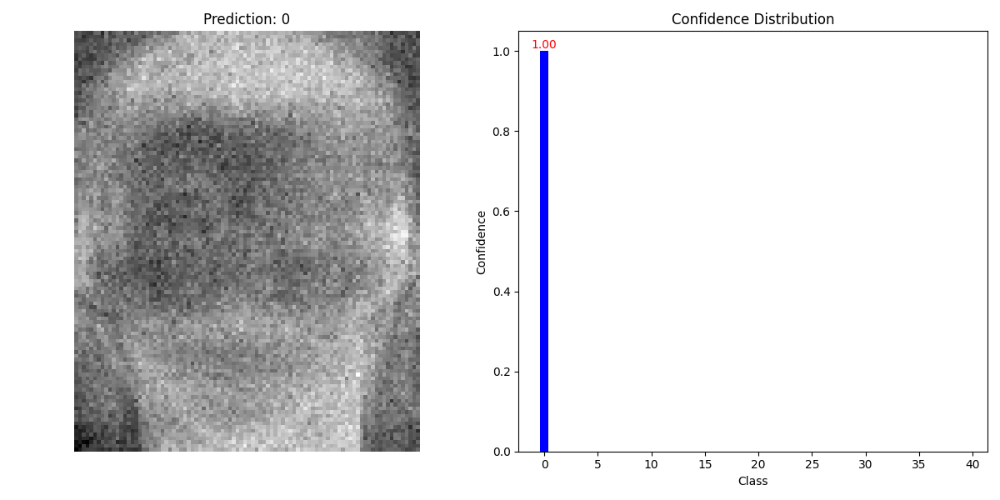
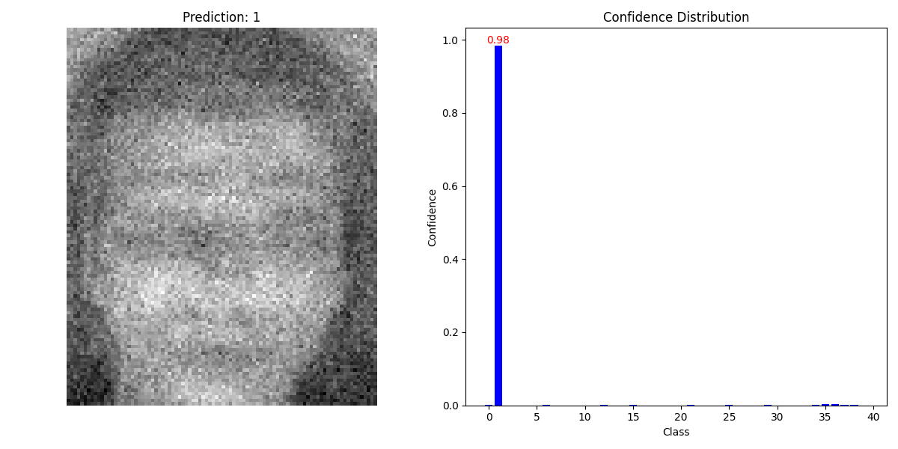
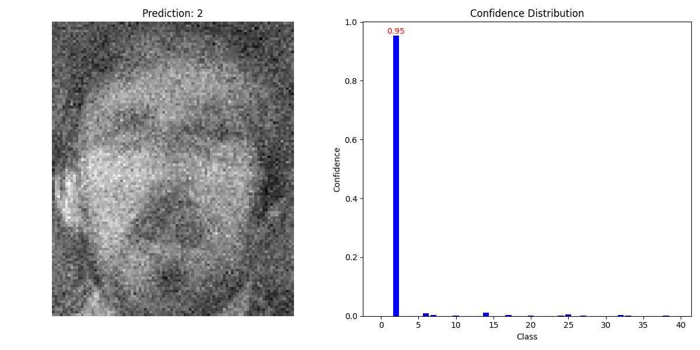
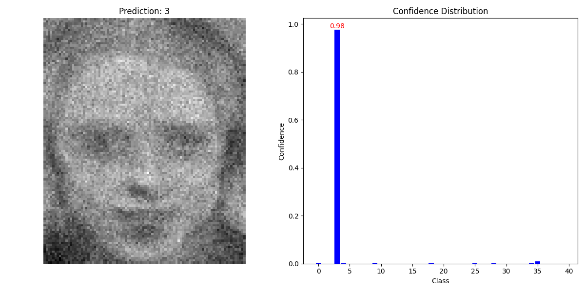
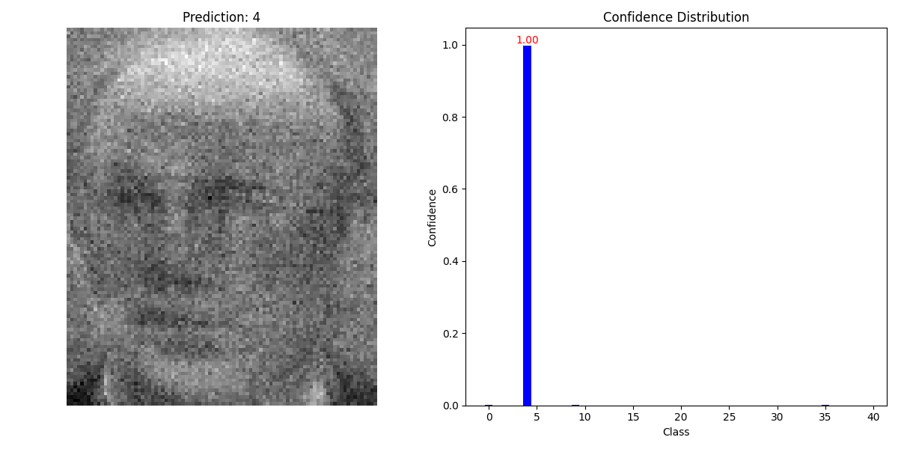
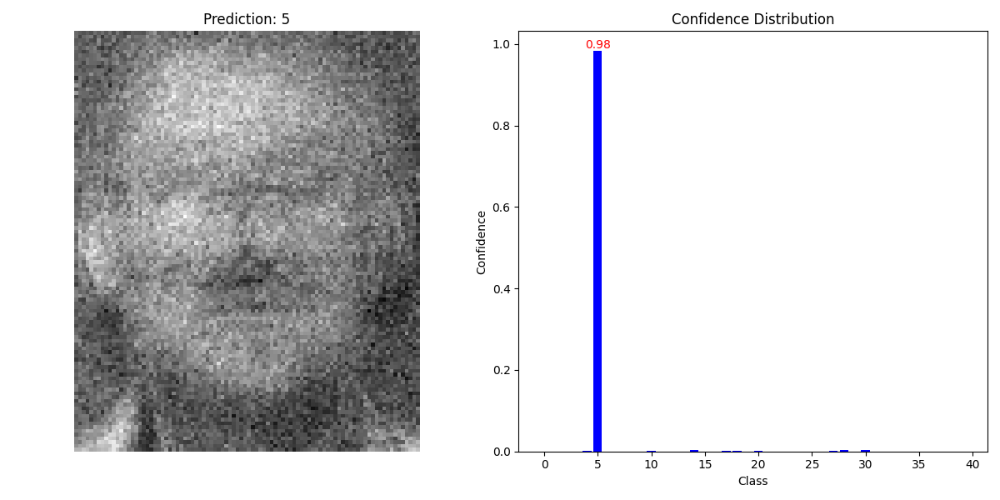

# model_attack_system


## Evaluation:

 

 

 

​																									.......

```cmd
PS D:\workshop\model_attack_system\backend\test> python .\test.py
Processed inverted_0.png: Prediction=0, True Label=0
Processed inverted_1.png: Prediction=1, True Label=1
Processed inverted_10.png: Prediction=10, True Label=10
Processed inverted_11.png: Prediction=11, True Label=11
Processed inverted_12.png: Prediction=12, True Label=12
Processed inverted_13.png: Prediction=13, True Label=13
Processed inverted_14.png: Prediction=14, True Label=14
Processed inverted_15.png: Prediction=15, True Label=15
Processed inverted_16.png: Prediction=16, True Label=16
Processed inverted_17.png: Prediction=17, True Label=17
Processed inverted_18.png: Prediction=18, True Label=18
Processed inverted_19.png: Prediction=19, True Label=19
Processed inverted_2.png: Prediction=2, True Label=2
Processed inverted_20.png: Prediction=20, True Label=20
Processed inverted_21.png: Prediction=21, True Label=21
Processed inverted_22.png: Prediction=22, True Label=22
Processed inverted_23.png: Prediction=23, True Label=23
Processed inverted_24.png: Prediction=24, True Label=24
Processed inverted_25.png: Prediction=25, True Label=25
Processed inverted_26.png: Prediction=26, True Label=26
Processed inverted_27.png: Prediction=27, True Label=27
Processed inverted_28.png: Prediction=28, True Label=28
Processed inverted_29.png: Prediction=29, True Label=29
Processed inverted_3.png: Prediction=3, True Label=3
Processed inverted_30.png: Prediction=30, True Label=30
Processed inverted_31.png: Prediction=31, True Label=31
Processed inverted_32.png: Prediction=32, True Label=32
Processed inverted_33.png: Prediction=33, True Label=33
Processed inverted_34.png: Prediction=34, True Label=34
Processed inverted_35.png: Prediction=35, True Label=35
Processed inverted_36.png: Prediction=36, True Label=36
Processed inverted_37.png: Prediction=37, True Label=37
Processed inverted_38.png: Prediction=38, True Label=38
Processed inverted_39.png: Prediction=39, True Label=39
Processed inverted_4.png: Prediction=4, True Label=4
Processed inverted_5.png: Prediction=5, True Label=5
Processed inverted_6.png: Prediction=6, True Label=6
Processed inverted_7.png: Prediction=7, True Label=7
Processed inverted_8.png: Prediction=8, True Label=8
Processed inverted_9.png: Prediction=9, True Label=9
Accuracy: 100.00%
Results saved to ./result/results.json
```

准确率？是因为类别数量太少了，还是评估方式的问题，考虑其他的评估方法

