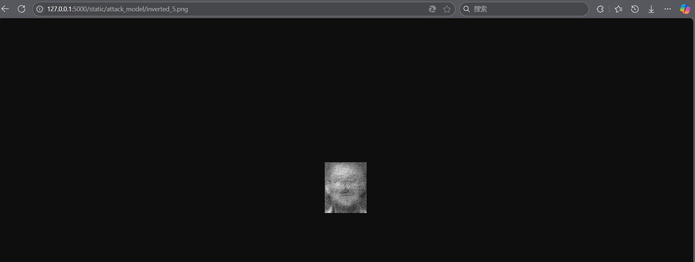
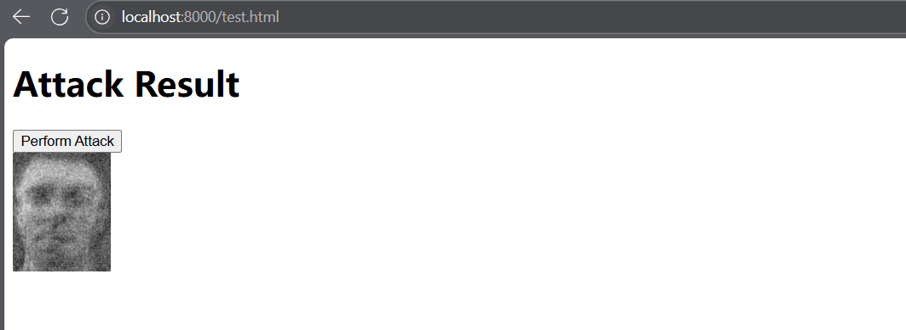

# Backend for the system


## Test Result:

#### Version1：

```cmd
D:\workshop\log\paper1\logZZPMAIN.attack\2025Jan09_16-26-05_LAPTOP-K5A5D0SQ_attack AT and T face>curl -v -X POST http://127.0.0.1:5000/predict -H "Content-Type: multipart/form-data" -F "file=@D:/workshop/log/paper1/logZZPMAIN.attack/2025Jan09_16-26-05_LAPTOP-K5A5D0SQ_attack AT and T face/inverted_1.png"

Note: Unnecessary use of -X or --request, POST is already inferred.

*   Trying 127.0.0.1:5000...

* Connected to 127.0.0.1 (127.0.0.1) port 5000

> POST /predict HTTP/1.1

> Host: 127.0.0.1:5000

> User-Agent: curl/8.9.1

> Accept: */*

> Content-Length: 20772

> Content-Type: multipart/form-data; boundary=------------------------wodYMd6WVhYHuH3eg6Kgoy

>

* upload completely sent off: 20772 bytes

< HTTP/1.1 200 OK

< Server: Werkzeug/3.1.3 Python/3.9.21

< Date: Fri, 10 Jan 2025 03:48:46 GMT

< Content-Type: application/json

< Content-Length: 947

< Connection: close

<

{"confidence":0.9830769300460815,"prediction":1,"probabilities":[0.0005909508327022195,0.9830769300460815,7.752644251013407e-07,0.0002748249680735171,4.681760856328765e-06,5.568262739785723e-09,0.0005664532072842121,6.649229908362031e-05,0.0002396729978499934,0.0003025699406862259,5.548062631532957e-07,0.00014782619837205857,0.0008039563545025885,0.0001007138635031879,4.46937019660254e-06,0.0008196898270398378,0.00020263686019461602,4.561612513498403e-06,2.430130734865088e-06,1.8068568579110433e-06,3.1057336258299983e-08,0.0016431291587650776,0.00020154773665126413,0.0001828279346227646,4.076133336639032e-05,0.000755425775423646,8.23995014798129e-06,1.5442680023625144e-08,4.076446202816442e-06,0.0006502430187538266,5.402056757475293e-08,0.00010254182416247204,8.745041668589693e-07,0.0002050086623057723,0.001637146226130426,0.003253447124734521,0.0025156771298497915,0.0005294329603202641,0.0006672250456176698,0.00039020017720758915]}

* shutting down connection #0
```

the file is the attack image of inverted_1:


#### Version2:

```cmd
D:\workshop\model_attack_system\backend\data\attack_result>curl -X POST -F "image_file=@inverted_0.png" http://127.0.0.1:5000/predict
{"confidences":[0.9999066591262817,1.2280409877201987e-14,1.6954745830917785e-17,1.0105771774959749e-10,8.646881724416744e-06,8.947771451724151e-15,9.043900739413857e-09,7.431045645489576e-08,1.1469040127332075e-11,3.982982525485568e-05,2.1794801519092744e-09,1.8524486833371157e-08,2.1369236241630674e-11,2.0821898372158643e-10,3.3832266415484424e-12,1.512131999475974e-12,8.058020284806844e-06,1.0333295330511305e-10,1.5688745604296866e-13,1.1297270763191772e-13,3.4119977893390385e-13,6.139843078400986e-10,1.5305627858869242e-13,3.273044682505777e-11,6.677323138859492e-09,3.6014247939419874e-07,1.5936328168209002e-07,3.5782697693775845e-08,2.5806195935729193e-06,5.979808648248763e-09,3.7072862557607777e-09,5.94339791856742e-17,4.44113192402118e-12,8.087092800979079e-11,5.982101924928429e-09,1.2012806109851226e-05,2.1501626179087907e-05,3.4293561046450094e-11,4.1994473220022255e-13,1.9009787640507023e-14],"prediction":0}

# 注意json内容""包含
D:\workshop\model_attack_system\backend\data\attack>curl -X POST http://127.0.0.1:5000/attack -H "Content-Type: application/json" -d "{\"target_label\": 5}"
{"message":"Attack successful","result_image":"./data/attack/inverted_5.png"}
# 查看渲染结果是否正确，我这里不知道REACT的具体用法跟普通前端是否有区别，测试一下接口渲染图片是正确的就行：修改了静态文件配置：：app = Flask(__name__, static_url_path="/static", static_folder="./data")，于是可以
# 访问http://127.0.0.1:5000/static/attack/inverted_5.png 提供访问
```



```cmd
PS D:\workshop\model_attack_system\backend\test> python .\test.py
Processed inverted_0.png: Prediction=0, True Label=0
Processed inverted_1.png: Prediction=1, True Label=1
Processed inverted_10.png: Prediction=10, True Label=10
Processed inverted_11.png: Prediction=11, True Label=11
Processed inverted_12.png: Prediction=12, True Label=12
Processed inverted_13.png: Prediction=13, True Label=13
Processed inverted_14.png: Prediction=14, True Label=14
Processed inverted_15.png: Prediction=15, True Label=15
Processed inverted_16.png: Prediction=16, True Label=16
Processed inverted_17.png: Prediction=17, True Label=17
Processed inverted_18.png: Prediction=18, True Label=18
Processed inverted_19.png: Prediction=19, True Label=19
Processed inverted_2.png: Prediction=2, True Label=2
Processed inverted_20.png: Prediction=20, True Label=20
Processed inverted_21.png: Prediction=21, True Label=21
Processed inverted_22.png: Prediction=22, True Label=22
Processed inverted_23.png: Prediction=23, True Label=23
Processed inverted_24.png: Prediction=24, True Label=24
Processed inverted_25.png: Prediction=25, True Label=25
Processed inverted_26.png: Prediction=26, True Label=26
Processed inverted_27.png: Prediction=27, True Label=27
Processed inverted_28.png: Prediction=28, True Label=28
Processed inverted_29.png: Prediction=29, True Label=29
Processed inverted_3.png: Prediction=3, True Label=3
Processed inverted_30.png: Prediction=30, True Label=30
Processed inverted_31.png: Prediction=31, True Label=31
Processed inverted_32.png: Prediction=32, True Label=32
Processed inverted_33.png: Prediction=33, True Label=33
Processed inverted_34.png: Prediction=34, True Label=34
Processed inverted_35.png: Prediction=35, True Label=35
Processed inverted_36.png: Prediction=36, True Label=36
Processed inverted_37.png: Prediction=37, True Label=37
Processed inverted_38.png: Prediction=38, True Label=38
Processed inverted_39.png: Prediction=39, True Label=39
Processed inverted_4.png: Prediction=4, True Label=4
Processed inverted_5.png: Prediction=5, True Label=5
Processed inverted_6.png: Prediction=6, True Label=6
Processed inverted_7.png: Prediction=7, True Label=7
Processed inverted_8.png: Prediction=8, True Label=8
Processed inverted_9.png: Prediction=9, True Label=9
Accuracy: 100.00%
Results saved to ./result/results.json
```

是因为类别数量太少了吗，还是评估方法的问题


## 使用方法(实时更新)：

修改目标模型文件`target_model.py`和攻击模型的数据集目录

```cmd
python .\server.py
```

## 环境（实时更新）

```cmd
PS D:\workshop\model_attack_system\backend\test> conda list
# packages in environment at D:\soft\Anaconda\Anaconda\envs\MAS:
#
# Name                    Version                   Build  Channel
async-timeout             5.0.1                    pypi_0    pypi
blas                      1.0                         mkl
blinker                   1.9.0                    pypi_0    pypi
brotli-python             1.0.9            py39h5da7b33_9
ca-certificates           2024.12.31           haa95532_0
certifi                   2024.12.14       py39haa95532_0
charset-normalizer        3.3.2              pyhd3eb1b0_0
click                     8.1.8                    pypi_0    pypi
colorama                  0.4.6            py39haa95532_0
contourpy                 1.3.0                    pypi_0    pypi
cudatoolkit               11.3.1               h59b6b97_2
cycler                    0.12.1                   pypi_0    pypi
filelock                  3.13.1           py39haa95532_0
flask                     3.1.0                    pypi_0    pypi
flask-cors                5.0.1                    pypi_0    pypi
fonttools                 4.55.3                   pypi_0    pypi
freetype                  2.12.1               ha860e81_0
giflib                    5.2.2                h7edc060_0
gmpy2                     2.1.2            py39h7f96b67_0
idna                      3.7              py39haa95532_0
importlib-metadata        8.5.0                    pypi_0    pypi
importlib-resources       6.5.2                    pypi_0    pypi
intel-openmp              2023.1.0         h59b6b97_46320
itsdangerous              2.2.0                    pypi_0    pypi
jinja2                    3.1.4            py39haa95532_1
jpeg                      9e                   h827c3e9_3
kiwisolver                1.4.7                    pypi_0    pypi
lcms2                     2.16                 hb4a4139_0
lerc                      4.0.0                h5da7b33_0
libdeflate                1.22                 h5bf469e_0
libjpeg-turbo             2.0.0                h196d8e1_0
libpng                    1.6.39               h8cc25b3_0
libtiff                   4.5.1                h44ae7cf_1
libuv                     1.48.0               h827c3e9_0
libwebp                   1.3.2                hbc33d0d_0
libwebp-base              1.3.2                h3d04722_1
lz4-c                     1.9.4                h2bbff1b_1
markupsafe                2.1.3            py39h2bbff1b_0
matplotlib                3.9.4                    pypi_0    pypi
mkl                       2023.1.0         h6b88ed4_46358
mkl-service               2.4.0            py39h2bbff1b_1
mkl_fft                   1.3.11           py39h827c3e9_0
mkl_random                1.2.8            py39hc64d2fc_0
mpc                       1.1.0                h7edee0f_1
mpfr                      4.0.2                h62dcd97_1
mpir                      3.0.0                hec2e145_1
mpmath                    1.3.0            py39haa95532_0
networkx                  3.2.1            py39haa95532_0
numpy                     2.0.1            py39h055cbcc_1
numpy-base                2.0.1            py39h65a83cf_1
openjpeg                  2.5.2                hae555c5_0
openssl                   3.0.15               h827c3e9_0
packaging                 24.2                     pypi_0    pypi
pillow                    11.0.0           py39h096bfcc_1
pip                       24.2             py39haa95532_0
psutil                    7.0.0                    pypi_0    pypi
py3nvml                   0.2.7                    pypi_0    pypi
pyparsing                 3.2.1                    pypi_0    pypi
pysocks                   1.7.1            py39haa95532_0
python                    3.9.21               h8205438_1
python-dateutil           2.9.0.post0              pypi_0    pypi
pytorch                   2.5.1               py3.9_cpu_0    pytorch
pytorch-mutex             1.0                         cpu    pytorch
pyyaml                    6.0.2            py39h827c3e9_0
redis                     5.2.1                    pypi_0    pypi
requests                  2.32.3           py39haa95532_1
setuptools                75.1.0           py39haa95532_0
six                       1.17.0                   pypi_0    pypi
sqlite                    3.45.3               h2bbff1b_0
sympy                     1.13.3           py39haa95532_0
tbb                       2021.8.0             h59b6b97_0
torchaudio                2.5.1                  py39_cpu    pytorch
torchvision               0.20.1                 py39_cpu    pytorch
typing_extensions         4.12.2           py39haa95532_0
tzdata                    2024b                h04d1e81_0
urllib3                   2.2.3            py39haa95532_0
vc                        14.40                haa95532_2
vs2015_runtime            14.42.34433          h9531ae6_2
werkzeug                  3.1.3                    pypi_0    pypi
wheel                     0.44.0           py39haa95532_0
win_inet_pton             1.1.0            py39haa95532_0
xmltodict                 0.14.2                   pypi_0    pypi
xz                        5.4.6                h8cc25b3_1
yaml                      0.2.5                he774522_0
zipp                      3.21.0                   pypi_0    pypi
zlib                      1.2.13               h8cc25b3_1
zstd                      1.5.6                h8880b57_0
```


## 接口文档：

###### 1.文件上传upload

请求体：

```
POST http://localhost:5000/upload \
  -F "file=@/path/to/your/file.png" \
```

返回结果：（状态吗400报错，500成功）

```shell
D:\model_attack_system\backend\data\target>curl -X POST http://localhost:5000/upload -F "file=@D:/model_attack_system/backend/data/target/1.png" -i
HTTP/1.1 400 BAD REQUEST
Server: Werkzeug/3.1.3 Python/3.9.21
Date: Wed, 26 Feb 2025 07:59:45 GMT
Content-Type: application/json
Content-Length: 30
Access-Control-Allow-Origin: *
Connection: close

{"error":"Invalid file type"}

D:\model_attack_system\backend\data\target>curl -X POST http://localhost:5000/upload -F "file=@D:/model_attack_system/backend/data/target/mynet_50.pkl" -i
HTTP/1.1 200 OK
Server: Werkzeug/3.1.3 Python/3.9.21
Date: Wed, 26 Feb 2025 07:56:04 GMT
Content-Type: application/json
Content-Length: 54
Access-Control-Allow-Origin: *
Connection: close

{"message":"File mynet_50.pkl uploaded successfully"}
```


###### 2.生成图返回

请求体

```shell
curl -X POST http://localhost:5000/attack \
-H "Content-Type: application/json" \
-d "{\"target_label\": 10}"
```

后端（Flask）生成图像并返回字节流：后端将生成的图像作为字节流返回，并设置正确的 MIME 类型。

结果：

```
C:\Users\wrwut>curl -X POST http://localhost:5000/attack -H "Content-Type: application/json" -d "{\"target_label\": 10}"
{"image":"XXX(BASE64)","message":"Attack successful"}
```

前端推荐参考，为react版本没试过,记得加base64解码：

```
const AttackComponent = () => {
    const [imageSrc, setImageSrc] = useState(null);
    const [error, setError] = useState(null);

    const handleAttack = async () => {
        try {
            // 请求后端获取图像
            const response = await fetch('http://localhost:5000/attack', {
                method: 'POST',
                headers: {
                    'Content-Type': 'application/json',
                },
                body: JSON.stringify({ target_label: 10 })  // 传递需要的 target_label
            });

            if (!response.ok) {
                throw new Error('Failed to fetch image');
            }

            const imageBlob = await response.blob();
            const imageUrl = URL.createObjectURL(imageBlob);
            setImageSrc(imageUrl);  // 设置图像 URL

        } catch (error) {
            setError(error.message);
        }
    };

    return (
        <div>
            <button onClick={handleAttack}>Attack</button>
            {error && <p>{error}</p>}
            {imageSrc && }
        </div>
    );
};

export default AttackComponent;
```

例外的完整的可见根目录test.html：

