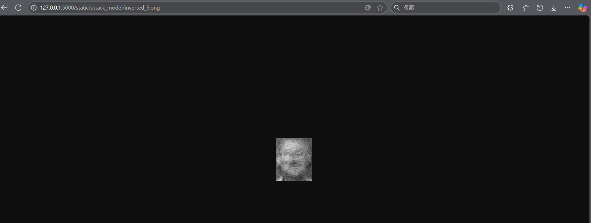
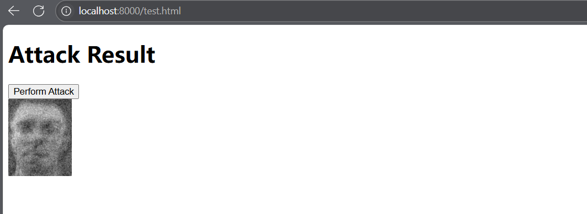

# Backend for the system


## Test Result:

#### Version1：

```cmd
D:\workshop\log\paper1\logZZPMAIN.attack\2025Jan09_16-26-05_LAPTOP-K5A5D0SQ_attack AT and T face>curl -v -X POST http://127.0.0.1:5000/predict -H "Content-Type: multipart/form-data" -F "file=@D:/workshop/log/paper1/logZZPMAIN.attack/2025Jan09_16-26-05_LAPTOP-K5A5D0SQ_attack AT and T face/inverted_1.png"

Note: Unnecessary use of -X or --request, POST is already inferred.

*   Trying 127.0.0.1:5000...

* Connected to 127.0.0.1 (127.0.0.1) port 5000

> POST /predict HTTP/1.1

> Host: 127.0.0.1:5000

> User-Agent: curl/8.9.1

> Accept: */*

> Content-Length: 20772

> Content-Type: multipart/form-data; boundary=------------------------wodYMd6WVhYHuH3eg6Kgoy

>

* upload completely sent off: 20772 bytes

< HTTP/1.1 200 OK

< Server: Werkzeug/3.1.3 Python/3.9.21

< Date: Fri, 10 Jan 2025 03:48:46 GMT

< Content-Type: application/json

< Content-Length: 947

< Connection: close

<

{"confidence":0.9830769300460815,"prediction":1,"probabilities":[0.0005909508327022195,0.9830769300460815,7.752644251013407e-07,0.0002748249680735171,4.681760856328765e-06,5.568262739785723e-09,0.0005664532072842121,6.649229908362031e-05,0.0002396729978499934,0.0003025699406862259,5.548062631532957e-07,0.00014782619837205857,0.0008039563545025885,0.0001007138635031879,4.46937019660254e-06,0.0008196898270398378,0.00020263686019461602,4.561612513498403e-06,2.430130734865088e-06,1.8068568579110433e-06,3.1057336258299983e-08,0.0016431291587650776,0.00020154773665126413,0.0001828279346227646,4.076133336639032e-05,0.000755425775423646,8.23995014798129e-06,1.5442680023625144e-08,4.076446202816442e-06,0.0006502430187538266,5.402056757475293e-08,0.00010254182416247204,8.745041668589693e-07,0.0002050086623057723,0.001637146226130426,0.003253447124734521,0.0025156771298497915,0.0005294329603202641,0.0006672250456176698,0.00039020017720758915]}

* shutting down connection #0
```

the file is the attack image of inverted_1:


#### Version2:

```cmd
D:\workshop\model_attack_system\backend\data\attack_result>curl -X POST -F "image_file=@inverted_0.png" http://127.0.0.1:5000/predict
{"confidences":[0.9999066591262817,1.2280409877201987e-14,1.6954745830917785e-17,1.0105771774959749e-10,8.646881724416744e-06,8.947771451724151e-15,9.043900739413857e-09,7.431045645489576e-08,1.1469040127332075e-11,3.982982525485568e-05,2.1794801519092744e-09,1.8524486833371157e-08,2.1369236241630674e-11,2.0821898372158643e-10,3.3832266415484424e-12,1.512131999475974e-12,8.058020284806844e-06,1.0333295330511305e-10,1.5688745604296866e-13,1.1297270763191772e-13,3.4119977893390385e-13,6.139843078400986e-10,1.5305627858869242e-13,3.273044682505777e-11,6.677323138859492e-09,3.6014247939419874e-07,1.5936328168209002e-07,3.5782697693775845e-08,2.5806195935729193e-06,5.979808648248763e-09,3.7072862557607777e-09,5.94339791856742e-17,4.44113192402118e-12,8.087092800979079e-11,5.982101924928429e-09,1.2012806109851226e-05,2.1501626179087907e-05,3.4293561046450094e-11,4.1994473220022255e-13,1.9009787640507023e-14],"prediction":0}

# 注意json内容""包含
D:\workshop\model_attack_system\backend\data\attack>curl -X POST http://127.0.0.1:5000/attack -H "Content-Type: application/json" -d "{\"target_label\": 5}"
{"message":"Attack successful","result_image":"./data/attack/inverted_5.png"}
# 查看渲染结果是否正确，我这里不知道REACT的具体用法跟普通前端是否有区别，测试一下接口渲染图片是正确的就行：修改了静态文件配置：：app = Flask(__name__, static_url_path="/static", static_folder="./data")，于是可以
# 访问http://127.0.0.1:5000/static/attack/inverted_5.png 提供访问
```



```cmd
PS D:\workshop\model_attack_system\backend\test> python .\test.py
Processed inverted_0.png: Prediction=0, True Label=0
Processed inverted_1.png: Prediction=1, True Label=1
Processed inverted_10.png: Prediction=10, True Label=10
Processed inverted_11.png: Prediction=11, True Label=11
Processed inverted_12.png: Prediction=12, True Label=12
Processed inverted_13.png: Prediction=13, True Label=13
Processed inverted_14.png: Prediction=14, True Label=14
Processed inverted_15.png: Prediction=15, True Label=15
Processed inverted_16.png: Prediction=16, True Label=16
Processed inverted_17.png: Prediction=17, True Label=17
Processed inverted_18.png: Prediction=18, True Label=18
Processed inverted_19.png: Prediction=19, True Label=19
Processed inverted_2.png: Prediction=2, True Label=2
Processed inverted_20.png: Prediction=20, True Label=20
Processed inverted_21.png: Prediction=21, True Label=21
Processed inverted_22.png: Prediction=22, True Label=22
Processed inverted_23.png: Prediction=23, True Label=23
Processed inverted_24.png: Prediction=24, True Label=24
Processed inverted_25.png: Prediction=25, True Label=25
Processed inverted_26.png: Prediction=26, True Label=26
Processed inverted_27.png: Prediction=27, True Label=27
Processed inverted_28.png: Prediction=28, True Label=28
Processed inverted_29.png: Prediction=29, True Label=29
Processed inverted_3.png: Prediction=3, True Label=3
Processed inverted_30.png: Prediction=30, True Label=30
Processed inverted_31.png: Prediction=31, True Label=31
Processed inverted_32.png: Prediction=32, True Label=32
Processed inverted_33.png: Prediction=33, True Label=33
Processed inverted_34.png: Prediction=34, True Label=34
Processed inverted_35.png: Prediction=35, True Label=35
Processed inverted_36.png: Prediction=36, True Label=36
Processed inverted_37.png: Prediction=37, True Label=37
Processed inverted_38.png: Prediction=38, True Label=38
Processed inverted_39.png: Prediction=39, True Label=39
Processed inverted_4.png: Prediction=4, True Label=4
Processed inverted_5.png: Prediction=5, True Label=5
Processed inverted_6.png: Prediction=6, True Label=6
Processed inverted_7.png: Prediction=7, True Label=7
Processed inverted_8.png: Prediction=8, True Label=8
Processed inverted_9.png: Prediction=9, True Label=9
Accuracy: 100.00%
Results saved to ./result/results.json
```

是因为类别数量太少了吗，还是评估方法的问题


## 使用方法(实时更新)：

修改目标模型文件`target_model.py`和攻击模型的数据集目录

```cmd
python .\server.py
```

## 环境（实时更新）

```cmd
PS D:\workshop\model_attack_system\backend\test> conda list
# packages in environment at D:\soft\Anaconda\Anaconda\envs\MAS:
#
# Name                    Version                   Build  Channel
# packages in environment at D:\soft\Anaconda\Anaconda\envs\MAS:
#
# Name                    Version                   Build  Channel
async-timeout             5.0.1                    pypi_0    pypi
blas                      1.0                         mkl
blinker                   1.9.0                    pypi_0    pypi
brotli-python             1.0.9            py39h5da7b33_9
ca-certificates           2025.2.25            haa95532_0
certifi                   2025.1.31        py39haa95532_0
charset-normalizer        3.3.2              pyhd3eb1b0_0
click                     8.1.8                    pypi_0    pypi
colorama                  0.4.6            py39haa95532_0
contourpy                 1.3.0                    pypi_0    pypi
cuda-cccl                 12.4.127                      0    nvidia
cuda-cudart               12.1.105                      0    nvidia
cuda-cudart-dev           12.1.105                      0    nvidia
cuda-cupti                12.1.105                      0    nvidia
cuda-libraries            12.1.0                        0    nvidia
cuda-libraries-dev        12.1.0                        0    nvidia
cuda-nvrtc                12.1.105                      0    nvidia
cuda-nvrtc-dev            12.1.105                      0    nvidia
cuda-nvtx                 12.1.105                      0    nvidia
cuda-opencl               12.4.127                      0    nvidia
cuda-opencl-dev           12.4.127                      0    nvidia
cuda-profiler-api         12.4.127                      0    nvidia
cuda-runtime              12.1.0                        0    nvidia
cudatoolkit               11.3.1              hf2f0253_13    conda-forge
cycler                    0.12.1                   pypi_0    pypi
filelock                  3.13.1           py39haa95532_0
flask                     3.1.0                    pypi_0    pypi
flask-cors                5.0.1                    pypi_0    pypi
fonttools                 4.55.3                   pypi_0    pypi
freetype                  2.12.1               ha860e81_0
fsspec                    2025.2.0                 pypi_0    pypi
giflib                    5.2.2                h7edc060_0
gmpy2                     2.1.2            py39h7f96b67_0
idna                      3.7              py39haa95532_0
importlib-metadata        8.5.0                    pypi_0    pypi
importlib-resources       6.5.2                    pypi_0    pypi
intel-openmp              2023.1.0         h59b6b97_46320
itsdangerous              2.2.0                    pypi_0    pypi
jinja2                    3.1.4            py39haa95532_1
jpeg                      9e                   h827c3e9_3
kiwisolver                1.4.7                    pypi_0    pypi
kornia                    0.6.6                    pypi_0    pypi
lcms2                     2.16                 hb4a4139_0
lerc                      4.0.0                h5da7b33_0
libcublas                 12.1.0.26                     0    nvidia
libcublas-dev             12.1.0.26                     0    nvidia
libcufft                  11.0.2.4                      0    nvidia
libcufft-dev              11.0.2.4                      0    nvidia
libcurand                 10.3.5.147                    0    nvidia
libcurand-dev             10.3.5.147                    0    nvidia
libcusolver               11.4.4.55                     0    nvidia
libcusolver-dev           11.4.4.55                     0    nvidia
libcusparse               12.0.2.55                     0    nvidia
libcusparse-dev           12.0.2.55                     0    nvidia
libdeflate                1.22                 h5bf469e_0
libjpeg-turbo             2.0.0                h196d8e1_0
libnpp                    12.0.2.50                     0    nvidia
libnpp-dev                12.0.2.50                     0    nvidia
libnvjitlink              12.1.105                      0    nvidia
libnvjitlink-dev          12.1.105                      0    nvidia
libnvjpeg                 12.1.1.14                     0    nvidia
libnvjpeg-dev             12.1.1.14                     0    nvidia
libpng                    1.6.39               h8cc25b3_0
libtiff                   4.5.1                h44ae7cf_1
libuv                     1.48.0               h827c3e9_0
libwebp                   1.3.2                hbc33d0d_0
libwebp-base              1.3.2                h3d04722_1
lz4-c                     1.9.4                h2bbff1b_1
markupsafe                2.1.3            py39h2bbff1b_0
matplotlib                3.9.4                    pypi_0    pypi
mkl                       2023.1.0         h6b88ed4_46358
mkl-service               2.4.0            py39h2bbff1b_1
mkl_fft                   1.3.11           py39h827c3e9_0
mkl_random                1.2.8            py39hc64d2fc_0
mpc                       1.1.0                h7edee0f_1
mpfr                      4.0.2                h62dcd97_1
mpir                      3.0.0                hec2e145_1
mpmath                    1.3.0            py39haa95532_0
networkx                  3.2.1            py39haa95532_0
numpy                     1.23.2                   pypi_0    pypi
openjpeg                  2.5.2                hae555c5_0
openssl                   3.4.1                ha4e3fda_0    conda-forge
packaging                 24.2                     pypi_0    pypi
pillow                    9.2.0                    pypi_0    pypi
pip                       24.2             py39haa95532_0
protobuf                  3.20.1                   pypi_0    pypi
psutil                    7.0.0                    pypi_0    pypi
py3nvml                   0.2.7                    pypi_0    pypi
pyparsing                 3.2.1                    pypi_0    pypi
pysocks                   1.7.1            py39haa95532_0
python                    3.9.21               h8205438_1
python-dateutil           2.9.0.post0              pypi_0    pypi
pytorch                   2.5.1           py3.9_cuda12.1_cudnn9_0    pytorch
pytorch-cuda              12.1                 hde6ce7c_6    pytorch
pytorch-mutex             1.0                        cuda    pytorch
pyyaml                    6.0.2            py39h827c3e9_0
redis                     5.2.1                    pypi_0    pypi
requests                  2.32.3           py39haa95532_1
scipy                     1.9.0                    pypi_0    pypi
setuptools                75.1.0           py39haa95532_0
six                       1.17.0                   pypi_0    pypi
sqlite                    3.45.3               h2bbff1b_0
sympy                     1.13.1                   pypi_0    pypi
tbb                       2021.8.0             h59b6b97_0
tensorboardx              2.5.1                    pypi_0    pypi
torchaudio                2.5.1                    pypi_0    pypi
torchvision               0.20.1                   pypi_0    pypi
tqdm                      4.66.5           py39h9909e9c_0
typing_extensions         4.12.2           py39haa95532_0
tzdata                    2024b                h04d1e81_0
ucrt                      10.0.22621.0         h57928b3_1    conda-forge
urllib3                   2.2.3            py39haa95532_0
vc                        14.40                haa95532_2
vc14_runtime              14.42.34433         h6356254_24    conda-forge
vs2015_runtime            14.42.34433         hfef2bbc_24    conda-forge
werkzeug                  3.1.3                    pypi_0    pypi
wheel                     0.44.0           py39haa95532_0
win_inet_pton             1.1.0            py39haa95532_0
xmltodict                 0.14.2                   pypi_0    pypi
xz                        5.4.6                h8cc25b3_1
yaml                      0.2.5                he774522_0
zipp                      3.21.0                   pypi_0    pypi
zlib                      1.2.13               h8cc25b3_1
zstd                      1.5.6                h8880b57_0
```


## 接口文档：

###### 1.文件上传upload

请求体：

```
POST http://localhost:5000/checkpoint \
  -F "file=@/path/to/your/file.png" \
```

返回结果：（状态吗400报错，500成功）

```shell
D:\model_attack_system\backend\data\target>curl -X POST http://localhost:5000/checkpoint -F "file=@D:/model_attack_system/backend/data/target/1.png" -i
HTTP/1.1 400 BAD REQUEST
Server: Werkzeug/3.1.3 Python/3.9.21
Date: Wed, 26 Feb 2025 07:59:45 GMT
Content-Type: application/json
Content-Length: 30
Access-Control-Allow-Origin: *
Connection: close

{"error":"Invalid file type"}

D:\model_attack_system\backend\data\target>curl -X POST http://localhost:5000/checkpoint -F "file=@D:/model_attack_system/backend/data/target/mynet_50.pkl" -i
HTTP/1.1 200 OK
Server: Werkzeug/3.1.3 Python/3.9.21
Date: Wed, 26 Feb 2025 07:56:04 GMT
Content-Type: application/json
Content-Length: 54
Access-Control-Allow-Origin: *
Connection: close

{"message":"File mynet_50.pkl uploaded successfully"}
```


###### 2.生成图返回

请求体

```shell
curl -X POST http://localhost:5000/attack \
-H "Content-Type: application/json" \
-d "{\"target_label\": 10}"
```

后端（Flask）生成图像并返回字节流：后端将生成的图像作为字节流返回，并设置正确的 MIME 类型。

结果：

```
C:\Users\wrwut>curl -X POST http://localhost:5000/attack -H "Content-Type: application/json" -d "{\"target_label\": 10}"
{"image":"XXX(BASE64)","message":"Attack successful"}
```

前端推荐参考，为react版本没试过,记得加base64解码：

```
const AttackComponent = () => {
    const [imageSrc, setImageSrc] = useState(null);
    const [error, setError] = useState(null);

    const handleAttack = async () => {
        try {
            // 请求后端获取图像
            const response = await fetch('http://localhost:5000/attack', {
                method: 'POST',
                headers: {
                    'Content-Type': 'application/json',
                },
                body: JSON.stringify({ target_label: 10 })  // 传递需要的 target_label
            });

            if (!response.ok) {
                throw new Error('Failed to fetch image');
            }

            const imageBlob = await response.blob();
            const imageUrl = URL.createObjectURL(imageBlob);
            setImageSrc(imageUrl);  // 设置图像 URL

        } catch (error) {
            setError(error.message);
        }
    };

    return (
        <div>
            <button onClick={handleAttack}>Attack</button>
            {error && <p>{error}</p>}
            {imageSrc && }
        </div>
    );
};

export default AttackComponent;
```

例外的完整的可见根目录test.html：




加入新的攻击方法PIG-MI：


好像有点不一样，是不是太小了，看看前端能不能进行放大吧


项目结构：

```
|   attack_model.py
|   attack_system.db
|   README.md
|   reconstruct.py
|   server.py
|   target_model.py
|   utils.py
|   开发文档.pdf
|
+---attack
|   |   PIG_attack.py
|   |   standard_attack.py
|   |   __init__.py
|   |
|   \---__pycache__
|           new_attack.cpython-39.pyc
|           PIG_attack.cpython-39.pyc
|           standard_attack.cpython-39.pyc
|           __init__.cpython-39.pyc
|
+---models
|   |   evaluation.py
|   |   inception.py
|   |   losses.py
|   |   MLP.py
|   |   mynet_50.pkl
|   |   resnet64.py
|   |
|   +---classifiers
|   |   |   classifier.py
|   |   |   evolve.py
|   |   |   __init__.py
|   |   |
|   |   \---__pycache__
|   |           classifier.cpython-39.pyc
|   |           evolve.cpython-39.pyc
|   |           __init__.cpython-39.pyc
|   |
|   +---metrics
|   |   |   fid.py
|   |   |   __init__.py
|   |   |
|   |   \---__pycache__
|   |           fid.cpython-39.pyc
|   |           __init__.cpython-39.pyc
|   |
|   \---__pycache__
|           evaluation.cpython-39.pyc
|           inception.cpython-39.pyc
|           losses.cpython-39.pyc
|           MLP.cpython-311.pyc
|           MLP.cpython-39.pyc
|           resnet64.cpython-39.pyc
|
+---README.assets
|       image-20250110222329528.png
|       image-20250226180652567.png
|       image-20250304223646042.png
|       inverted_1.png
|
+---result
|   +---attack
|   |       inverted_0.png
|			...
|   |
|   \---PLG_MI_Inversion
|       +---all_imgs
|       |   +---12
|       |   |       attack_iden_12_0.png
|       |   |       attack_iden_12_1.png
|       |   |       attack_iden_12_2.png
|       |   |       attack_iden_12_3.png
|       |   |       attack_iden_12_4.png
|       |   |
|       |   \---5
|       |           attack_iden_5_0.png
|       |           attack_iden_5_1.png
|       |           attack_iden_5_2.png
|       |           attack_iden_5_3.png
|       |           attack_iden_5_4.png
|       |
|       \---success_imgs
|           +---12
|           |       0_attack_iden_12_0.png
|           |       0_attack_iden_12_1.png
|           |       0_attack_iden_12_2.png
|           |       0_attack_iden_12_3.png
|           |       0_attack_iden_12_4.png
|           |
|           \---5
|                   0_attack_iden_5_0.png
|                   0_attack_iden_5_1.png
|                   0_attack_iden_5_2.png
|                   0_attack_iden_5_3.png
|                   0_attack_iden_5_4.png
|
+---test
|   |   test1.py
|   |
|   +---result
|   |       inverted_0.png_visualization.png
|			...
|   |
|   \---target_train
|           model1_MLP.py
|
+---upload
|   +---evaluate_model
|   |       FaceNet_95.88.tar
|   |
|   +---PIG
|   |       gen_VGG16_celeba.pth.tar
|   \---target_model
|           IR152_91.16.tar
|           VGG16_88.26.tar
|
\---__pycache__
        attack_model.cpython-311.pyc
        attack_model.cpython-39.pyc
        reconstruct.cpython-39.pyc
        server.cpython-311.pyc
        target_model.cpython-311.pyc
        target_model.cpython-39.pyc
        utils.cpython-39.pyc
```


## Version3:

要求：

```
目标描述
原图对比
消耗资源显示
```

先完成之前后面部署进来的PIG攻击的VGG16的预测功能，先固定攻击celeba数据集：

```
PS D:\workshop\model_attack_system\backend> python .\predict.py
D:\soft\Anaconda\Anaconda\envs\MAS\lib\site-packages\torchvision\models\_utils.py:208: UserWarning: The parameter 'pretrained' is deprecated 
since 0.13 and may be removed in the future, please use 'weights' instead.
  warnings.warn(
D:\soft\Anaconda\Anaconda\envs\MAS\lib\site-packages\torchvision\models\_utils.py:223: UserWarning: Arguments other than a weight enum or `None` for 'weights' are deprecated since 0.13 and may be removed in the future. The current behavior is equivalent to passing `weights=VGG16_BN_Weights.IMAGENET1K_V1`. You can also use `weights=VGG16_BN_Weights.DEFAULT` to get the most up-to-date weights.
  warnings.warn(msg)
D:\workshop\model_attack_system\backend\predict.py:39: FutureWarning: You are using `torch.load` with `weights_only=False` (the current default value), which uses the default pickle module implicitly. It is possible to construct malicious pickle data which will execute arbitrary code during unpickling (See https://github.com/pytorch/pytorch/blob/main/SECURITY.md#untrusted-models for more details). In a future release, the default value for `weights_only` will be flipped to `True`. This limits the functions that could be executed during unpickling. Arbitrary 
objects will no longer be allowed to be loaded via this mode unless they are explicitly allowlisted by the user via `torch.serialization.add_safe_globals`. We recommend you start setting `weights_only=True` for any use case where you don't have full control of the loaded file. Please open an issue on GitHub for any issues related to this experimental feature.
  checkpoint = torch.load(model_path, map_location=device)
Predicted Class: 5
Confidence Scores: tensor([1.6414e-06, 6.1673e-07, 8.2095e-06, 2.4295e-08, 6.6434e-11, 9.8475e-01,
        2.0676e-11, 3.3364e-08, 2.2202e-06, 1.7704e-09, 1.1452e-06, 2.3355e-06,
        2.3594e-09, 6.9459e-09, 8.8761e-10, 4.0656e-09, 9.6632e-08, 8.9762e-10,
        4.0934e-09, 9.2090e-08, 6.9407e-09, 1.7048e-06, 7.7648e-10, 1.6861e-06,
        7.7546e-05, 1.1378e-07, 2.4180e-06, 2.1296e-09, 1.4135e-07, 3.7009e-08,
        1.2204e-06, 1.8835e-06, 6.6296e-07, 1.1738e-08, 4.2673e-09, 1.1204e-07,
        1.5950e-07, 7.7628e-08, 1.6968e-08, 1.4061e-09, 2.8906e-08, 1.3891e-07,
        5.3824e-09, 7.1922e-08, 4.6170e-08, 5.4648e-09, 5.6904e-04, 4.4445e-07,
        2.9202e-08, 8.8891e-08, 4.4333e-08, 7.5620e-08, 8.9648e-09, 1.6126e-08,
        6.5615e-10, 7.9205e-08, 6.2439e-09, 5.6565e-08, 5.8649e-10, 5.1493e-09,
        1.3302e-08, 7.0599e-10, 2.9459e-10, 1.4912e-11, 2.3541e-07, 6.7509e-07,
        1.1975e-05, 7.5305e-08, 5.1416e-08, 1.8964e-08, 2.3529e-08, 2.5654e-10,
        3.2582e-07, 8.8956e-09, 1.1613e-08, 6.5421e-08, 1.1585e-06, 5.3662e-09,
        3.6664e-07, 5.2435e-08, 5.1182e-07, 6.7267e-07, 2.4669e-05, 1.0662e-10,
        1.2347e-08, 1.1340e-08, 1.3365e-07, 6.2826e-07, 7.2689e-11, 3.5130e-09,
        2.6177e-09, 5.4290e-08, 3.3245e-08, 2.4029e-07, 1.2687e-05, 1.7327e-08,
        1.7702e-09, 8.8956e-07, 6.5177e-07, 8.1793e-08, 2.4512e-07, 6.2356e-08,
        6.3352e-08, 6.5148e-09, 5.5887e-07, 5.8088e-08, 1.3130e-08, 7.3557e-08,
        2.5233e-08, 1.1267e-07, 2.5073e-07, 1.1205e-07, 1.1249e-08, 8.2213e-08,
        1.4179e-08, 9.3803e-09, 8.5268e-09, 5.9560e-08, 3.1810e-08, 2.4358e-08,
        3.4498e-07, 2.0843e-07, 2.1516e-04, 3.2578e-09, 2.0552e-05, 3.7537e-08,
        4.0564e-07, 3.4833e-08, 4.3415e-06, 4.4267e-09, 2.3122e-09, 9.9193e-08,
        1.9190e-11, 1.3523e-08, 1.1909e-08, 4.0263e-11, 2.3603e-08, 5.4764e-09,
        9.1610e-06, 4.2089e-08, 1.4448e-08, 4.7394e-06, 2.6754e-08, 1.0313e-09,
        2.6337e-10, 2.6130e-07, 2.3302e-08, 1.0250e-08, 9.0008e-09, 2.0956e-08,
        3.0960e-07, 1.9326e-05, 9.6887e-08, 3.0867e-08, 1.4183e-10, 1.4974e-06,
        5.9238e-07, 1.0354e-06, 1.4081e-05, 1.9140e-08, 1.0186e-05, 1.6953e-08,
        2.4423e-10, 7.8504e-07, 3.6583e-06, 1.6024e-08, 1.7246e-09, 1.0650e-05,
        2.8003e-08, 5.8782e-07, 9.3180e-07, 9.7151e-09, 4.0151e-08, 1.2781e-05,
        2.0264e-03, 1.2322e-09, 2.3982e-05, 2.8246e-08, 2.9378e-06, 1.7229e-08,
        2.9906e-07, 8.1029e-08, 2.4494e-09, 1.0841e-04, 2.7173e-07, 2.0256e-09,
        7.5472e-07, 3.4610e-08, 7.2072e-09, 6.7757e-09, 3.6710e-09, 8.4138e-11,
        8.8354e-10, 1.8198e-07, 6.9863e-07, 4.5861e-05, 6.3954e-07, 2.9024e-09,
        1.7433e-06, 6.3010e-08, 5.9764e-11, 1.1608e-09, 2.2677e-07, 2.9718e-08,
        2.0904e-09, 5.4935e-06, 5.1649e-07, 1.2022e-04, 1.1501e-07, 1.1740e-06,
        1.9314e-07, 9.0181e-07, 1.5749e-08, 2.4870e-09, 1.3135e-09, 2.8167e-08,
        8.2992e-10, 1.9098e-07, 6.1370e-08, 4.9278e-10, 2.1603e-09, 1.5836e-07,
        1.3706e-06, 9.4806e-10, 1.8259e-08, 2.7788e-08, 1.0034e-07, 1.0618e-08,
        1.9818e-09, 3.8953e-10, 2.8498e-07, 2.1277e-07, 4.2541e-10, 7.5896e-09,
        2.8964e-07, 5.8131e-05, 3.6073e-06, 2.9423e-06, 1.5141e-09, 5.5642e-07,
        1.2471e-07, 2.4090e-09, 1.8344e-06, 1.1103e-06, 9.2138e-07, 6.1041e-10,
        2.1447e-08, 1.2595e-09, 1.0682e-09, 3.3441e-09, 2.0567e-09, 1.8796e-09,
        5.8011e-07, 1.4015e-07, 7.0136e-08, 1.0367e-09, 4.2510e-10, 1.2220e-10,
        7.5077e-08, 1.3695e-07, 9.1103e-08, 2.9982e-08, 7.1414e-08, 5.7301e-08,
        4.6248e-09, 3.2069e-07, 1.8605e-07, 1.8363e-07, 9.4223e-10, 1.0666e-07,
        1.7398e-08, 4.2814e-08, 1.1239e-08, 4.1007e-08, 4.0827e-08, 2.4483e-08,
        7.7479e-08, 9.0980e-08, 4.4896e-08, 8.7584e-08, 2.2923e-05, 2.4351e-09,
        1.9252e-09, 5.3439e-09, 1.0073e-07, 3.4396e-09, 3.5738e-10, 1.8047e-10,
        8.8380e-10, 2.5787e-08, 1.4895e-09, 9.4146e-09, 3.0595e-09, 1.3934e-09,
        1.6137e-09, 2.7481e-08, 9.0852e-10, 5.4367e-09, 5.1973e-07, 2.9767e-08,
        8.5534e-07, 1.0836e-07, 2.7467e-09, 1.5208e-07, 1.8746e-09, 8.7485e-07,
        1.0866e-07, 5.3148e-08, 9.0786e-07, 1.5320e-08, 1.3128e-08, 2.2777e-07,
        2.0659e-10, 1.4294e-07, 7.0951e-07, 2.5639e-10, 2.7567e-09, 6.5439e-09,
        2.0868e-08, 3.4556e-08, 9.1670e-07, 1.0742e-08, 5.5929e-05, 1.9113e-06,
        5.1894e-07, 8.6616e-08, 2.5568e-07, 8.9243e-05, 1.5382e-06, 3.0922e-05,
        1.6588e-08, 2.0753e-06, 1.0489e-08, 4.3760e-08, 1.2787e-09, 1.4647e-08,
        1.1123e-08, 1.7790e-06, 7.9532e-11, 9.3092e-06, 2.1559e-06, 1.4532e-09,
        3.2823e-07, 5.8537e-07, 5.6305e-09, 1.1469e-06, 2.9874e-07, 1.6921e-03,
        1.2404e-06, 2.4421e-10, 3.7201e-04, 1.1931e-07, 3.3681e-07, 1.9535e-09,
        1.4422e-06, 5.7747e-08, 1.6021e-06, 7.8738e-08, 1.3558e-07, 8.8512e-08,
        3.1721e-05, 1.3908e-04, 3.8810e-07, 8.9512e-10, 2.3141e-07, 9.9968e-09,
        6.6372e-08, 4.1591e-07, 1.7374e-05, 2.2298e-09, 3.8163e-09, 3.6069e-08,
        6.7572e-09, 5.1816e-05, 4.9830e-08, 7.9158e-07, 1.2187e-07, 2.6349e-09,
        6.8162e-09, 4.1831e-07, 1.5192e-07, 6.2828e-07, 2.9471e-07, 3.9439e-09,
        1.3268e-07, 7.1640e-07, 1.2301e-06, 9.8780e-09, 5.6494e-08, 2.2601e-09,
        1.4808e-10, 2.2541e-07, 8.9098e-07, 2.2105e-08, 2.0440e-08, 2.0329e-06,
        5.1782e-08, 4.8472e-10, 2.6887e-07, 1.0559e-07, 1.7303e-08, 3.6777e-10,
        1.5494e-04, 5.1202e-08, 4.3654e-06, 2.3400e-06, 2.6115e-10, 3.3674e-08,
        1.5198e-07, 4.0636e-07, 7.1164e-09, 9.3382e-09, 1.6250e-08, 4.9840e-08,
        2.0376e-09, 5.2597e-09, 8.3753e-08, 1.6869e-09, 2.5083e-06, 3.1380e-08,
        7.5534e-08, 2.8628e-07, 1.4372e-06, 2.4944e-06, 2.3536e-07, 5.3499e-05,
        1.4200e-07, 1.1631e-08, 1.5468e-10, 4.4631e-08, 3.5553e-09, 6.4872e-06,
        1.9047e-07, 1.2505e-07, 8.3705e-08, 3.1925e-10, 2.2947e-09, 8.8568e-08,
        1.1428e-04, 7.7591e-09, 4.7792e-09, 1.4791e-08, 2.1990e-10, 1.7438e-07,
        1.0860e-08, 5.6927e-08, 3.5990e-06, 1.0766e-07, 1.4615e-08, 1.3956e-10,
        1.0222e-09, 3.1997e-07, 4.5402e-05, 3.8621e-08, 2.0043e-07, 5.3840e-07,
        1.9251e-07, 1.3665e-08, 2.0956e-07, 2.5258e-09, 2.2562e-08, 9.5584e-11,
        6.9082e-08, 1.5840e-06, 9.2327e-08, 6.6513e-07, 1.0506e-08, 3.8150e-12,
        3.1247e-07, 4.6558e-09, 2.6022e-10, 5.5838e-09, 4.4376e-07, 5.9167e-09,
        2.4736e-09, 2.0772e-07, 7.8903e-11, 1.3437e-04, 1.8563e-08, 5.0219e-09,
        1.1131e-11, 3.1837e-08, 3.8515e-07, 7.7065e-07, 1.6863e-08, 1.9602e-07,
        8.8554e-09, 3.3336e-10, 5.4876e-08, 9.7114e-11, 1.4096e-05, 3.5570e-08,
        2.1894e-09, 6.4349e-10, 2.7205e-07, 1.6542e-09, 3.2950e-08, 1.4461e-07,
        6.0950e-09, 7.9660e-09, 2.0711e-06, 4.8224e-09, 1.2730e-08, 1.6757e-07,
        1.2189e-10, 3.1477e-05, 9.6925e-07, 3.3384e-06, 4.0264e-07, 5.8816e-09,
        1.8539e-06, 7.1812e-10, 4.2336e-09, 9.6272e-10, 8.2397e-09, 4.0733e-09,
        9.7906e-08, 4.9440e-07, 2.6045e-08, 4.3684e-07, 2.1373e-11, 1.6787e-07,
        2.1771e-09, 5.8765e-09, 4.2394e-07, 1.4442e-07, 1.2114e-06, 9.1576e-06,
        4.7400e-09, 4.1248e-07, 5.0305e-05, 6.2322e-07, 4.0271e-10, 4.6064e-07,
        1.1514e-08, 6.2215e-09, 3.2390e-07, 2.0132e-06, 7.9741e-07, 2.1112e-10,
        2.7253e-08, 3.0025e-09, 2.2838e-08, 1.2140e-05, 2.9029e-07, 3.5280e-07,
        2.9424e-07, 3.4650e-10, 1.1651e-09, 6.1464e-06, 1.5495e-06, 4.4718e-06,
        1.6913e-08, 3.8940e-08, 2.9951e-09, 1.7058e-08, 6.5576e-09, 8.4924e-09,
        8.9870e-08, 2.4752e-07, 6.8780e-10, 1.2788e-08, 1.3566e-08, 6.5441e-10,
        2.0215e-10, 4.4038e-07, 9.4996e-09, 1.4231e-07, 5.7367e-09, 3.3413e-06,
        8.2686e-09, 5.7343e-07, 7.4057e-06, 6.5599e-09, 4.2003e-09, 1.0040e-09,
        7.6372e-07, 3.3449e-09, 9.7342e-09, 1.0068e-09, 1.2718e-10, 1.4743e-09,
        2.0420e-08, 1.6290e-07, 8.8182e-08, 1.7352e-09, 1.2747e-09, 1.0274e-09,
        1.5057e-08, 3.9805e-09, 1.2073e-09, 8.0644e-09, 2.9156e-10, 4.9069e-07,
        1.3079e-08, 6.0282e-08, 1.4786e-07, 4.5449e-08, 8.1238e-09, 4.2014e-09,
        1.0497e-05, 1.8083e-09, 6.2380e-08, 5.4267e-09, 1.9931e-07, 5.1853e-09,
        1.3330e-07, 1.5287e-07, 3.6796e-08, 5.8488e-08, 2.1038e-08, 3.8118e-09,
        3.0946e-10, 2.4080e-07, 2.7287e-06, 7.5091e-08, 6.9978e-04, 1.1126e-08,
        3.6966e-09, 1.8144e-06, 3.7955e-06, 1.6759e-10, 3.3523e-06, 5.2745e-07,
        8.0465e-09, 1.6526e-09, 4.4952e-06, 1.8018e-08, 8.3963e-10, 6.5344e-09,
        1.4447e-06, 4.3750e-07, 4.5121e-09, 2.0136e-10, 4.1103e-07, 9.7316e-07,
        4.5770e-06, 7.6339e-09, 7.1443e-07, 5.6115e-06, 1.2348e-08, 2.4732e-09,
        2.2199e-10, 4.9568e-07, 1.2632e-09, 2.9744e-09, 3.6063e-08, 1.9800e-09,
        3.2752e-07, 2.1316e-10, 4.1420e-11, 2.4826e-10, 5.3830e-06, 7.3682e-09,
        2.3227e-10, 2.2963e-07, 4.6750e-07, 7.8562e-10, 7.4250e-08, 3.9654e-10,
        1.7359e-08, 2.5343e-08, 7.6570e-05, 1.1086e-06, 1.8357e-07, 3.6750e-06,
        1.6782e-06, 1.3042e-10, 5.9902e-11, 4.9168e-08, 1.2845e-09, 1.5144e-07,
        5.8435e-06, 4.0886e-06, 3.8315e-09, 1.3821e-07, 5.6927e-09, 5.1943e-08,
        1.2782e-06, 2.2776e-07, 7.4346e-09, 3.3150e-05, 7.2103e-05, 8.9296e-07,
        8.7867e-09, 3.0318e-06, 8.9702e-09, 3.8852e-06, 6.9192e-05, 1.7980e-05,
        9.7635e-09, 5.9127e-08, 1.6323e-07, 3.6936e-08, 1.5135e-08, 1.7825e-09,
        4.6045e-10, 2.4790e-08, 7.0570e-10, 2.5045e-08, 1.0766e-07, 5.2951e-10,
        2.0075e-08, 4.3658e-08, 4.4459e-11, 2.6032e-08, 7.4494e-10, 4.8844e-10,
        3.3451e-09, 1.9739e-08, 5.0695e-08, 1.0071e-08, 3.1064e-08, 1.3833e-05,
        4.0865e-08, 1.0112e-08, 1.7294e-07, 1.5989e-07, 1.2750e-06, 5.3572e-08,
        7.0187e-07, 3.8579e-09, 8.6308e-07, 5.2259e-10, 3.9802e-07, 1.3807e-08,
        1.8261e-08, 9.2246e-09, 1.7829e-08, 1.0268e-08, 1.5857e-07, 3.3609e-10,
        4.1505e-09, 8.2889e-08, 5.1022e-07, 8.7933e-06, 7.4237e-10, 1.5024e-06,
        4.0390e-09, 1.7674e-06, 2.4041e-05, 3.2974e-09, 4.1363e-07, 1.8987e-08,
        4.3296e-09, 8.2826e-09, 1.0990e-09, 1.9256e-06, 3.2780e-05, 1.0145e-09,
        3.1462e-07, 8.9890e-09, 8.4441e-09, 1.5035e-07, 6.4724e-10, 1.2249e-07,
        9.9610e-07, 3.2449e-08, 1.7088e-09, 5.0019e-07, 8.8423e-08, 5.0978e-08,
        3.1396e-06, 1.9026e-10, 6.9434e-08, 2.7971e-08, 2.1263e-07, 7.2975e-09,
        7.4885e-06, 4.8771e-07, 3.4067e-07, 2.3479e-08, 2.8577e-07, 2.9071e-09,
        1.5583e-09, 1.7441e-05, 9.1609e-08, 5.3585e-08, 1.0985e-04, 8.9699e-09,
        2.4688e-08, 1.7616e-05, 5.0514e-06, 5.7145e-08, 6.2359e-08, 3.4809e-08,
        2.3963e-09, 4.2432e-06, 1.2812e-06, 2.2725e-07, 5.0694e-10, 1.9140e-07,
        9.2026e-10, 1.9185e-08, 6.2661e-09, 1.3042e-07, 1.6455e-04, 4.9660e-04,
        1.9678e-08, 4.6275e-11, 6.1685e-09, 4.7997e-08, 1.1296e-08, 1.0377e-09,
        3.0912e-07, 4.3442e-09, 6.4400e-08, 5.4698e-09, 3.7665e-05, 2.3213e-09,
        1.7866e-09, 8.8293e-10, 1.0321e-07, 3.4475e-05, 1.5018e-06, 3.5396e-06,
        5.6891e-07, 2.0529e-08, 3.2347e-05, 9.6418e-09, 8.9920e-08, 5.5600e-06,
        4.6611e-05, 1.4026e-08, 1.6170e-09, 4.6243e-08, 3.5181e-09, 1.8281e-07,
        4.3303e-05, 1.6507e-06, 1.2711e-09, 1.1839e-11, 9.0354e-10, 1.5566e-10,
        2.5804e-07, 4.2870e-08, 4.0677e-08, 5.0004e-07, 1.0858e-08, 1.3295e-09,
        8.2313e-11, 3.6873e-07, 7.6069e-08, 1.6018e-03, 4.5001e-07, 2.6369e-06,
        1.0245e-08, 2.8153e-04, 3.6223e-07, 3.2001e-07, 1.4578e-07, 8.0937e-08,
        6.5228e-08, 9.6907e-10, 8.4423e-09, 2.6476e-08, 4.0956e-08, 1.7441e-07,
        6.0812e-09, 4.3479e-09, 4.9841e-09, 9.9347e-04, 4.4463e-06, 1.9586e-06,
        6.5907e-09, 5.1117e-08, 6.2082e-12, 9.2116e-09, 1.1295e-05, 1.4710e-08,
        9.8128e-07, 5.0410e-08, 2.7532e-08, 6.3424e-08, 3.2666e-08, 7.5777e-10,
        1.9956e-06, 5.0272e-06, 1.1832e-09, 2.3105e-06, 3.8408e-07, 3.8727e-09,
        2.0255e-06, 3.9154e-05, 2.0283e-04, 2.3331e-10, 4.3102e-08, 6.2765e-10,
        5.7363e-08, 2.2157e-08, 1.8367e-08, 1.5981e-10, 1.4885e-08, 1.3831e-09,
        3.6140e-08, 1.9389e-08, 1.5335e-07, 2.0678e-08, 9.1297e-07, 1.0761e-06,
        5.0612e-07, 1.3744e-05, 1.3684e-07, 4.3869e-09, 1.5414e-09, 6.8143e-07,
        6.0881e-09, 6.1197e-08, 5.3758e-07, 1.6833e-08, 8.9677e-07, 1.1136e-09,
        2.7897e-03, 1.2763e-06, 4.5066e-07, 7.0361e-06, 1.6264e-05, 5.6011e-10,
        7.4056e-09, 6.2680e-07, 2.5919e-09, 2.3889e-07, 1.2263e-05, 7.9986e-09,
        1.3543e-09, 2.6345e-07, 2.4795e-08, 5.2595e-08, 7.2403e-10, 5.3851e-08,
        9.3660e-08, 7.9430e-09, 2.5900e-08, 3.0640e-07, 8.3429e-06, 9.5780e-08,
        7.8995e-08, 3.1547e-05, 1.7115e-09, 1.8937e-08, 1.8373e-06, 8.9451e-07,
        3.5416e-10, 1.0060e-05, 1.2779e-09, 1.1700e-05, 6.9150e-09, 6.4256e-07,
        2.1874e-06, 1.0363e-06, 1.1849e-04, 2.0818e-10, 9.8755e-08, 3.7090e-06,
        7.8632e-09, 1.1637e-06, 6.3977e-08, 4.3824e-10, 4.9709e-08, 4.0312e-06,
        1.6119e-08, 4.6582e-08, 4.0587e-09, 5.6545e-12, 2.9372e-09, 2.1540e-08,
        2.4638e-08, 5.3060e-09, 3.2460e-05, 3.8368e-08, 1.2444e-06, 2.1272e-08,
        1.3425e-08, 3.0030e-06, 4.5186e-05, 3.4908e-08, 3.6354e-08, 1.5793e-07,
        6.5025e-05, 1.1519e-07, 2.2940e-09, 2.5157e-09, 4.8754e-08, 1.6587e-07,
        4.1333e-09, 1.9444e-08, 1.5731e-08, 1.5796e-09, 1.7031e-09, 3.9989e-08,
        1.5322e-07, 7.7744e-10, 4.7385e-07, 3.1271e-08], device='cuda:0')
        
        
#已同时兼容ir152和Facenet64的预测，测试通过
Predicted Class: 5
Predicted Class: 5
```

温馨提示，使用灰色数据集时要PIL载入图像要转换未L 灰度图，彩色图像数据集要转换为RGB格式

评估模块应该可以了，这样后端攻击结果展示的模块的应该就不行啊，那个需要其他参数的载入，如评估的模块的：

```
 #添加根据数据集来确定h和w和class_num,即模型的输入输出维度，不过实际上应该还要由模型架构决定，这里模型后三者写死了
                        if dataset =="att_faces":
                            h, w, class_num=112, 92, 40
                        elif dataset == "celeba":
                            h, w, class_num=64, 64, 1000
                        """还有ffhq和facescrub两种数据集，这里后面有需要再补"""


                        # 执行预测
                        prediction, confidences = predict_target_model(image,target_model, h, w, class_num)
```

或者时把输入输出维度改为：

1.模型文件里面，model.save()应该可以，但是我这里没有现成的VGG16，IR152,FaceNet64的目标模型pth或者tar文件

2.改为使用“数据集名称”参数，把if语句放到predict里面

3.在server里的结果模块也加上上面的部分，或者单独一个函数获取


通过加个“目标模型”的参数解决

完善前后端，不过还有一个不同数据集训练出来的模型去预测应该直接报错的(如下)

```
Traceback (most recent call last):
  File "D:\workshop\model_attack_system\backend\predict.py", line 141, in <module>
    prediction, confidences = predict_target_model(image, model_name, h, w, class_num)
  File "D:\workshop\model_attack_system\backend\predict.py", line 50, in predict_target_model
    model = load_model(model_name, h, w, class_num, device)
  File "D:\workshop\model_attack_system\backend\predict.py", line 42, in load_model
    model.load_state_dict(torch.load(model_path))
  File "D:\soft\Anaconda\Anaconda\envs\MAS\lib\site-packages\torch\nn\modules\module.py", line 2584, in load_state_dict
    raise RuntimeError(
RuntimeError: Error(s) in loading state_dict for MLP:
        size mismatch for fc.weight: copying a param with shape torch.Size([3000, 10304]) from checkpoint, the shape in codel is torch.Size([3000, 4096]).
        size mismatch for regression.weight: copying a param with shape torch.Size([40, 3000]) from checkpoint, the shapeent model is torch.Size([1000, 3000]).
        size mismatch for regression.bias: copying a param with shape torch.Size([40]) from checkpoint, the shape in currl is torch.Size([1000]).
```

不过它这里前端包报的是分类错误，是之前哪部分写死了吗，还有那个攻击历史的部分怎么变来变去的，它不会是请求历史的时候又进行了预测吧


## Version4:

使用watchdog监视传入的模型架构文件

```
PS D:\workshop\model_attack_system\backend> python .\importlib_test.py
Attempting to import module: models.classifiers.target_vgg16
Module target_vgg16 imported successfully!
Attempting to import module: models.classifiers.target_facenet64
Module target_facenet64 imported successfully!
Attempting to import module: models.classifiers.target_iri152
Module target_iri152 imported successfully!
Attempting to import module: models.classifiers.target_mlp
Module target_mlp imported successfully!
```

**模型上传后会被自动识别**（不用修改代码）

**模型类名和文件名可以不一致**（用 `MODEL_CLASS_NAME` ）

**前端选择模型后，后端动态实例化并执行推理**

```
curl -X POST http://localhost:5000/predict \
     -F "image_file=@test_MLP_ATT.png" \
     -F "model_name=target_mlp" \
     -F "param_file=MLP.pth"
```

目前先只支持需要输入输出维度的模型，后续可以增加模型参数的自动获取

结果：

```
D:\workshop\model_attack_system\backend>curl -X POST http://localhost:5000/predict -F "image_file=@test_MLP_ATT.png" -F "model_name=target_mlp" -F "param_file=MLP.pkl"
{
  "error,MLP 's problem:": "Error loading model target_mlp: No module named 'models.classifiers.target_mlp'"
}


#上传文件后，我这里直接复制粘贴
D:\workshop\model_attack_system\backend>curl -X POST http://localhost:5000/predict -F "image_file=@test_MLP_ATT.png" -F "model_name=target_mlp" -F "param_file=MLP.pkl"
{
  "confidences": [
    0.00048108104965649545,
    2.4042068616836332e-05,
    0.9256151914596558,
    4.883345536654815e-05,
    0.00018975640705320984,
    0.0002757258480414748,
    0.01242841873317957,
    0.004959143232554197,
    0.00016686355229467154,
    0.0006595852901227772,
    0.0015377476811408997,
    0.0003741365799214691,
    0.0006985210347920656,
    6.187042163219303e-05,
    0.01491565816104412,
    0.0001113349135266617,
    0.00010916754399659112,
    0.005245514679700136,
    0.000371561327483505,
    0.0005682806367985904,
    0.0032548438757658005,
    0.0011188600910827518,
    0.0013191252946853638,
    0.00035033520543947816,
    0.0016298082191497087,
    0.00782756507396698,
    0.0004716500989161432,
    0.0022968915291130543,
    0.001043121563270688,
    0.00017262612527702004,
    5.232793409959413e-05,
    0.0005455691716633737,
    0.003990177530795336,
    0.0041238125413656235,
    1.712028097244911e-05,
    0.0004623829445336014,
    8.730289118830115e-05,
    0.0009631034918129444,
    0.0013396053109318018,
    9.136961307376623e-05
  ],
  "prediction": 2
}

#其他接口
D:\workshop\model_attack_system\backend>curl -X GET http://localhost:5000/models
{
  "target_facenet64": "FaceNet64",
  "target_iri152": "IR152",
  "target_mlp": "MLP",
  "target_vgg16": "VGG16"
}

D:\workshop\model_attack_system\backend>curl -X GET http://localhost:5000/checkpoints
[
  "FaceNet64_88.50.tar",
  "IR152_91.16.tar",
  "MLP.pkl",
  "VGG16_88.26.tar"
]
```

现在MLP上传在实例化可以了，把其扩展一下，支持所有模型方法即可

现在直接使用PIL进行读取图像大小和灰色还是彩色，不过MLP为什么生成的图像也是彩色?把它转为灰色成功了(名字加了个1)

融合入server:

```
D:\workshop\model_attack_system\backend>curl -X POST http://localhost:5000/predict -F "image_file=@test_MLP_ATT1.png" -F "model_name=target_mlp" -F "param_file=MLP.pkl" -F "class_num=40"
{
  "confidences": [
    0.02415965311229229,
    0.024176275357604027,
    0.05133986100554466,
    0.024162176996469498,
    0.024159638211131096,
    0.024201277643442154,
    0.02416066825389862,
    0.024161646142601967,
    0.02928372099995613,
    0.024159647524356842,
    0.02416800707578659,
    0.024167805910110474,
    0.024164918810129166,
    0.024159854277968407,
    0.0241859070956707,
    0.02419096976518631,
    0.02416207268834114,
    0.024160360917448997,
    0.02418464608490467,
    0.024642013013362885,
    0.024575509130954742,
    0.0241597518324852,
    0.024169305339455605,
    0.024162273854017258,
    0.024162180721759796,
    0.024173134937882423,
    0.024159826338291168,
    0.024159958586096764,
    0.024159640073776245,
    0.02417937107384205,
    0.02415977232158184,
    0.024164246395230293,
    0.024159684777259827,
    0.0242747999727726,
    0.024159638211131096,
    0.024159638211131096,
    0.024159638211131096,
    0.02420753799378872,
    0.024179475381970406,
    0.024163400754332542
  ],
  "prediction": 2
}


------------------------------------------------------------------------------------------------------------
D:\workshop\model_attack_system\backend>curl -X POST http://localhost:5000/predict -F "image_file=@test_VGG16_celeba.png" -F "model_name=target_vgg16" -F "param_file=VGG16_88.26.tar" -F "class_num=1000"
{
  "confidences": [
    0.0009998672176152468,
    0.0009996090084314346,
    0.000999677344225347,
    0.0009995870059356093,
    0.0010001162299886346,
    0.0009999334579333663,
    0.0009999375324696302,
    0.0009997572051361203,
    0.0010007488308474422,
    0.0009997793240472674,
    0.0009999537141993642,
    0.000999819254502654,
    0.000999931595288217,
    0.0010002771159633994,
    0.0009998774621635675,
    0.000999888521619141,
    0.0009995120344683528,
    0.0009999050525948405,
    0.0009999186731874943,
    0.0010003361385315657,
    0.0009999989997595549,
    0.0009996758308261633,
    0.0010001419577747583,
    0.0010000693146139383,
    0.001000058720819652,
    0.0010003536008298397,
    0.0010003310162574053,
    0.0009999471949413419,
    0.001000083633698523,
    0.0009998276364058256,
    0.0010001729242503643,
    0.0009997423039749265,
    0.001000012387521565,
    0.0010000509209930897,
    0.0009999301983043551,
    0.000999692128971219,
    0.0009997747838497162,
    0.000999888521619141,
    0.000999927637167275,
    0.0010001863120123744,
    0.0009998505702242255,
    0.001000097719952464,
    0.001000323798507452,
    0.0009998392779380083,
    0.0009998803725466132,
    0.0010000028414651752,
    0.0009997828165069222,
    0.000999783631414175,
    0.0009998162277042866,
    0.0009998965542763472,
    0.001000070828013122,
    0.0010001403279602528,
    0.0010003495262935758,
    0.001000297605060041,
    0.0010000934125855565,
    0.0009999411413446069,
    0.00099983683321625,
    0.001000397140160203,
    0.001000034622848034,
    0.0010000818874686956,
    0.0009997199522331357,
    0.0010003714123740792,
    0.0010002449853345752,
    0.0009998988825827837,
    0.0010001689661294222,
    0.0009999341564252973,
    0.0010000377660617232,
    0.0010000941110774875,
    0.0009999024914577603,
    0.0010005624499171972,
    0.0010004567448049784,
    0.000999733805656433,
    0.0009998586028814316,
    0.0009999314788728952,
    0.0010000268230214715,
    0.0010003934148699045,
    0.0010001715272665024,
    0.0009997079614549875,
    0.0009997666347771883,
    0.0009998559253290296,
    0.0010000149486586452,
    0.0010000073816627264,
    0.0009998511523008347,
    0.0009996512671932578,
    0.001000692485831678,
    0.0010003845673054457,
    0.001000095042400062,
    0.0010001130867749453,
    0.0009997012093663216,
    0.0010002420749515295,
    0.0009997320594266057,
    0.0010000474285334349,
    0.0010000731563195586,
    0.0009998622117564082,
    0.0009999407920986414,
    0.0009997822344303131,
    0.0009999878238886595,
    0.0010001895716413856,
    0.0009996549924835563,
    0.000999893993139267,
    0.0009998386958613992,
    0.0009996999287977815,
    0.0009999460307881236,
    0.0009999455651268363,
    0.0009994669817388058,
    0.000999928335659206,
    0.000999767566099763,
    0.0010002462659031153,
    0.0009999341564252973,
    0.0009998353198170662,
    0.001000279444269836,
    0.0010000320617109537,
    0.000999851617962122,
    0.0010000711772590876,
    0.0010002270573750138,
    0.0010001356713473797,
    0.0009996675653383136,
    0.0010002582566812634,
    0.000999756739474833,
    0.0009999900357797742,
    0.0009996447479352355,
    0.001000058720819652,
    0.0009998559253290296,
    0.0010000279871746898,
    0.0009998086607083678,
    0.000999661162495613,
    0.0009997750166803598,
    0.0009999300818890333,
    0.0010004008654505014,
    0.0009998488239943981,
    0.000999733805656433,
    0.0010003511561080813,
    0.000999724492430687,
    0.0010000579059123993,
    0.0009997974848374724,
    0.0009998178575187922,
    0.0010000885231420398,
    0.0009996582521125674,
    0.0009998788591474295,
    0.001000130083411932,
    0.0009998769965022802,
    0.0010001449845731258,
    0.00099970365408808,
    0.0010000860784202814,
    0.0009996130829676986,
    0.0010000987676903605,
    0.0010001895716413856,
    0.0009999622125178576,
    0.0010000576730817556,
    0.0010003071511164308,
    0.0009998093592002988,
    0.0010005736257880926,
    0.001000327174551785,
    0.0010002582566812634,
    0.000999697484076023,
    0.0010002467315644026,
    0.0010001860791817307,
    0.0010000206530094147,
    0.0010000106412917376,
    0.0009998345049098134,
    0.0009998733876273036,
    0.001000155578367412,
    0.0009998086607083678,
    0.0009997179731726646,
    0.0009997331071645021,
    0.0010001173941418529,
    0.000999775598756969,
    0.0010004789801314473,
    0.0010000604670494795,
    0.0009998366003856063,
    0.0009997450979426503,
    0.0010000185575336218,
    0.0010002332273870707,
    0.0010000821202993393,
    0.0009999031899496913,
    0.000999901327304542,
    0.0009998924797400832,
    0.0009999355534091592,
    0.0010004581417888403,
    0.0009997328743338585,
    0.0010002509225159883,
    0.0010001470800489187,
    0.0010002291528508067,
    0.0010005595395341516,
    0.001000047312118113,
    0.0010005191434174776,
    0.0009998178575187922,
    0.0010001849150285125,
    0.0009998666355386376,
    0.0009997612796723843,
    0.0010000871261581779,
    0.0010001357877627015,
    0.0010000027250498533,
    0.0009998619789257646,
    0.001000456977635622,
    0.0009999523172155023,
    0.0009998322930186987,
    0.0010002593044191599,
    0.0010000840993598104,
    0.0010001356713473797,
    0.0009998355526477098,
    0.0009996037697419524,
    0.000999687472358346,
    0.0009998043533414602,
    0.0010000662878155708,
    0.000999617506749928,
    0.0010000966722145677,
    0.0009999979520216584,
    0.0009998672176152468,
    0.0009999420726671815,
    0.0009995232103392482,
    0.000999786308966577,
    0.00100016500800848,
    0.0009997545275837183,
    0.000999802490696311,
    0.001000716700218618,
    0.0009999244939535856,
    0.0009998411405831575,
    0.0010000074980780482,
    0.001000099116936326,
    0.0010001554619520903,
    0.0009999057510867715,
    0.0009997566230595112,
    0.0009998780442401767,
    0.0010000334586948156,
    0.0010001244954764843,
    0.0010000551119446754,
    0.0010000121546909213,
    0.0009999354369938374,
    0.0009999384637922049,
    0.0009998121531680226,
    0.0009999534813687205,
    0.0009998573223128915,
    0.0010001860791817307,
    0.0010001669870689511,
    0.000999891315586865,
    0.000999563024379313,
    0.0009999204194173217,
    0.000999758020043373,
    0.0010001023765653372,
    0.001000035903416574,
    0.0010001837508752942,
    0.0009998615132644773,
    0.0009997001616284251,
    0.0009997078450396657,
    0.0009997924789786339,
    0.001000218209810555,
    0.0010001154150813818,
    0.0009997471934184432,
    0.0009996588341891766,
    0.0009998849127441645,
    0.0010002790950238705,
    0.0010002917842939496,
    0.0010000834008678794,
    0.0009999581379815936,
    0.0009999171597883105,
    0.001000062795355916,
    0.0010001593036577106,
    0.0010000537149608135,
    0.0009997403249144554,
    0.0010000376496464014,
    0.0010000041220337152,
    0.0010000995825976133,
    0.0010003414936363697,
    0.0009996587177738547,
    0.0009996858425438404,
    0.0010002547642216086,
    0.0009999868925660849,
    0.0009999090107157826,
    0.001000358839519322,
    0.0010002587223425508,
    0.0009999974863603711,
    0.0009998150635510683,
    0.0009998896857723594,
    0.00099993497133255,
    0.0009998108725994825,
    0.000999568379484117,
    0.0009998615132644773,
    0.0009996021399274468,
    0.0010001689661294222,
    0.0010003714123740792,
    0.0009999432368203998,
    0.000999718438833952,
    0.001000573975034058,
    0.001000241725705564,
    0.0009997481247410178,
    0.001000097836367786,
    0.0010003651259467006,
    0.0009999542962759733,
    0.0010000145994126797,
    0.0010004559298977256,
    0.0009998832829296589,
    0.0010000133188441396,
    0.0009999149478971958,
    0.0010004914365708828,
    0.001000073621980846,
    0.0010001107584685087,
    0.0010000673355534673,
    0.0010001478949561715,
    0.0010001701302826405,
    0.0009998595342040062,
    0.0009999687317758799,
    0.0010001048212870955,
    0.0010002248454838991,
    0.0009998605819419026,
    0.0010000442853197455,
    0.0009997236775234342,
    0.0010001342743635178,
    0.0009998976020142436,
    0.0009998994646593928,
    0.0010005097137764096,
    0.0009998786263167858,
    0.0010000561596825719,
    0.0009999364847317338,
    0.0009999076137319207,
    0.0009998418390750885,
    0.00100065884180367,
    0.0009999471949413419,
    0.001000101794488728,
    0.0010001795599237084,
    0.0009998426539823413,
    0.0009999412577599287,
    0.0010001815389841795,
    0.0009998499881476164,
    0.000999755342490971,
    0.000999768846668303,
    0.0010000026086345315,
    0.0009997913148254156,
    0.0009998530149459839,
    0.001000089687295258,
    0.00099978968501091,
    0.0010004086652770638,
    0.0010002104099839926,
    0.001000145566649735,
    0.0009997989982366562,
    0.0010002099443227053,
    0.0009999979520216584,
    0.0010004309006035328,
    0.00099990947637707,
    0.000999840791337192,
    0.0010004558134824038,
    0.001000231015495956,
    0.0010001062182709575,
    0.0010000788606703281,
    0.0010001788614317775,
    0.0010003175120800734,
    0.0009999152971431613,
    0.0009999799076467752,
    0.0009998711757361889,
    0.0009998006280511618,
    0.0010002570925280452,
    0.0010005506919696927,
    0.0010001353221014142,
    0.0009997289162129164,
    0.000999782350845635,
    0.0010003456845879555,
    0.001000060816295445,
    0.001000310992822051,
    0.000999991549178958,
    0.0010001604678109288,
    0.0010000787442550063,
    0.0010000584879890084,
    0.0009998350869864225,
    0.0009995878208428621,
    0.001000202028080821,
    0.0010003605857491493,
    0.0010000995825976133,
    0.0010003498755395412,
    0.000999676063656807,
    0.0010002722265198827,
    0.0009998679161071777,
    0.0009996318258345127,
    0.0010001983027905226,
    0.000999893294647336,
    0.0009997072629630566,
    0.0010003020288422704,
    0.0010000420734286308,
    0.000999763491563499,
    0.0009999176254495978,
    0.0009998789755627513,
    0.000999977346509695,
    0.0009996402077376842,
    0.0009997804882004857,
    0.001000315765850246,
    0.0009995353175327182,
    0.0010001336922869086,
    0.0009997882880270481,
    0.0009999634930863976,
    0.0009998244931921363,
    0.0010003758361563087,
    0.0009995299624279141,
    0.0010002672206610441,
    0.0009999379981309175,
    0.0009999595349654555,
    0.0010005359072238207,
    0.000999879790470004,
    0.0010002790950238705,
    0.0009999811882153153,
    0.0009999913163483143,
    0.001000017044134438,
    0.0009999923640862107,
    0.0009999823523685336,
    0.000999761396087706,
    0.001000510877929628,
    0.0009997987654060125,
    0.0009998905006796122,
    0.0009998520836234093,
    0.000999919488094747,
    0.0009998526657000184,
    0.0009998789755627513,
    0.0010001779301092029,
    0.0009997707093134522,
    0.0010001701302826405,
    0.0009997630259022117,
    0.0010000771144405007,
    0.0010002875933423638,
    0.0010007424280047417,
    0.001000226242467761,
    0.0009999505709856749,
    0.0009999079629778862,
    0.0009998998139053583,
    0.0010002393973991275,
    0.0010001411428675056,
    0.0009999870089814067,
    0.0010005898075178266,
    0.0010005468502640724,
    0.0009996553417295218,
    0.0009996180888265371,
    0.0010007322998717427,
    0.000999884563498199,
    0.001000456977635622,
    0.0010003761854022741,
    0.0010000995825976133,
    0.0009996789740398526,
    0.0010000501060858369,
    0.000999721698462963,
    0.0010000282200053334,
    0.00100022426340729,
    0.0010000881738960743,
    0.0009999399771913886,
    0.000999832060188055,
    0.000999892014078796,
    0.000999945099465549,
    0.000999615527689457,
    0.001000481192022562,
    0.001000055344775319,
    0.0010001675691455603,
    0.000999994808807969,
    0.0010005771182477474,
    0.0009998331079259515,
    0.0009996920125558972,
    0.0010003811912611127,
    0.0010000881738960743,
    0.0009998916648328304,
    0.0009997517336159945,
    0.0009998225141316652,
    0.0009998828172683716,
    0.0009997680317610502,
    0.0009996209992095828,
    0.0009997166926041245,
    0.0009998772293329239,
    0.000999900628812611,
    0.000999845564365387,
    0.0009997814195230603,
    0.000999846262857318,
    0.0010000058682635427,
    0.0009997384622693062,
    0.0010000289184972644,
    0.0009999301983043551,
    0.0010003623319789767,
    0.0010000335751101375,
    0.0009999916655942798,
    0.0010001343907788396,
    0.0009997149463742971,
    0.0009994645370170474,
    0.0010000657057389617,
    0.0009999587200582027,
    0.000999819254502654,
    0.0009998370660468936,
    0.000999901443719864,
    0.0010001177433878183,
    0.0009998942259699106,
    0.0010000088950619102,
    0.0009998501045629382,
    0.0010012066923081875,
    0.0009998485911637545,
    0.0009995790896937251,
    0.000999521347694099,
    0.0010001647751778364,
    0.0010000364854931831,
    0.00100041669793427,
    0.001000040676444769,
    0.0009999420726671815,
    0.0010003112256526947,
    0.0010001033078879118,
    0.0009999657049775124,
    0.000999625539407134,
    0.0009998393943533301,
    0.0009998878231272101,
    0.000999943818897009,
    0.0009998587192967534,
    0.0009996920125558972,
    0.0009998534806072712,
    0.0009995871223509312,
    0.0009995809523388743,
    0.0009999866597354412,
    0.001000249176286161,
    0.0009996072622016072,
    0.0010000590700656176,
    0.0009999871253967285,
    0.0009999199537560344,
    0.0009998996974900365,
    0.0010002019116654992,
    0.0010003625648096204,
    0.001000284100882709,
    0.0009998303139582276,
    0.0010002786293625832,
    0.0010000650072470307,
    0.0010000697802752256,
    0.0009996405569836497,
    0.0009997031884267926,
    0.001000029849819839,
    0.0010000111069530249,
    0.000999722396954894,
    0.0009999204194173217,
    0.0009998669847846031,
    0.0010000121546909213,
    0.0009998679161071777,
    0.001000205404125154,
    0.0010000258916988969,
    0.0009998565074056387,
    0.0009999849135056138,
    0.0010001090122386813,
    0.0009996815351769328,
    0.0010000183247029781,
    0.0009996379958465695,
    0.0009998640744015574,
    0.0009998991154134274,
    0.0010001069167628884,
    0.0009998002788051963,
    0.000999798416160047,
    0.0010002120397984982,
    0.001000553136691451,
    0.0010000576730817556,
    0.0010001339251175523,
    0.0009997010929509997,
    0.0009997666347771883,
    0.0010001752525568008,
    0.0009998964378610253,
    0.0009996822336688638,
    0.0010000821202993393,
    0.00099983811378479,
    0.0010001055197790265,
    0.001000284100882709,
    0.0009997617453336716,
    0.0010000413749366999,
    0.0009999246103689075,
    0.0009997383458539844,
    0.0010002536000683904,
    0.0010003374191001058,
    0.0009998097084462643,
    0.0010000747861340642,
    0.00099992158357054,
    0.0010001629125326872,
    0.001000155694782734,
    0.0010000970214605331,
    0.0009998722234740853,
    0.0010003087809309363,
    0.001000208081677556,
    0.0009998820023611188,
    0.0009998540626838803,
    0.0009998026071116328,
    0.0009999973699450493,
    0.0009999409085139632,
    0.0009997844463214278,
    0.0009999568574130535,
    0.0009998518507927656,
    0.0010004538344219327,
    0.0009997389279305935,
    0.000999963958747685,
    0.0010002354392781854,
    0.0009996243752539158,
    0.0010001624468713999,
    0.0009998821187764406,
    0.0009999882895499468,
    0.0009999503381550312,
    0.0009997384622693062,
    0.000999899348244071,
    0.0009998712921515107,
    0.000999895972199738,
    0.0009999520843848586,
    0.0010004601208493114,
    0.0010000965557992458,
    0.0009999600006267428,
    0.0009996702428907156,
    0.0010005991207435727,
    0.0010000834008678794,
    0.0009997464949265122,
    0.0009998832829296589,
    0.0010003625648096204,
    0.0010004823561757803,
    0.0009995964355766773,
    0.0009997598826885223,
    0.0010000616312026978,
    0.0010006355587393045,
    0.0010003563947975636,
    0.0009999669855460525,
    0.0009998951572924852,
    0.0009998173918575048,
    0.0010003932984545827,
    0.0009997483575716615,
    0.0010002644266933203,
    0.0009998000459745526,
    0.0009997860761359334,
    0.0009999406756833196,
    0.001000415999442339,
    0.000999739277176559,
    0.0010002003982663155,
    0.0009999974863603711,
    0.0009997147135436535,
    0.0010000814218074083,
    0.0010000478941947222,
    0.0010001205373555422,
    0.00100018794182688,
    0.0010001074988394976,
    0.000999916228465736,
    0.0010001898044720292,
    0.0009998288005590439,
    0.0009999341564252973,
    0.0009998484747484326,
    0.0010001681512221694,
    0.0009999973699450493,
    0.0010002478957176208,
    0.0009996301960200071,
    0.001000383635982871,
    0.0010001215850934386,
    0.001000078278593719,
    0.0010000523179769516,
    0.0009997497545555234,
    0.0009998236782848835,
    0.0009998963214457035,
    0.000999819370917976,
    0.0010001702466979623,
    0.0009994687279686332,
    0.001000038580968976,
    0.0010002197232097387,
    0.0010000166948884726,
    0.001000046031549573,
    0.0009999851463362575,
    0.001000403892248869,
    0.0009996492881327868,
    0.0010000861948356032,
    0.0009996287990361452,
    0.0010001184418797493,
    0.0010000005131587386,
    0.0009998228633776307,
    0.0010001484770327806,
    0.000999883166514337,
    0.000999827985651791,
    0.0010002898052334785,
    0.001000119955278933,
    0.0009999951580539346,
    0.000999778276309371,
    0.001000041258521378,
    0.0010002661729231477,
    0.0009999361354857683,
    0.0010002934141084552,
    0.0010001217015087605,
    0.0010000671027228236,
    0.0010004646610468626,
    0.0009999972535297275,
    0.001000140095129609,
    0.001000154996290803,
    0.0010001352056860924,
    0.001000158954411745,
    0.0009998580208048224,
    0.001000114600174129,
    0.0010001942282542586,
    0.0009999140165746212,
    0.001000355463474989,
    0.001000308315269649,
    0.0010000752517953515,
    0.000999633688479662,
    0.0010000085458159447,
    0.0010002478957176208,
    0.0009997602319344878,
    0.0009998891036957502,
    0.001000516815111041,
    0.001000229618512094,
    0.000999968033283949,
    0.000999988871626556,
    0.0010002418421208858,
    0.0010003020288422704,
    0.0010000629117712379,
    0.0009996256558224559,
    0.000999715062789619,
    0.0010002376511693,
    0.0010001176269724965,
    0.0009999799076467752,
    0.0010000239126384258,
    0.001000252435915172,
    0.0009998185560107231,
    0.0010003095958381891,
    0.0009999265894293785,
    0.001000338583253324,
    0.0010003824718296528,
    0.000999784329906106,
    0.000999998184852302,
    0.0009998829336836934,
    0.0009998501045629382,
    0.000999490381218493,
    0.0010000531328842044,
    0.0010002696653828025,
    0.0009995686123147607,
    0.0009999761823564768,
    0.0010000882903113961,
    0.001000070944428444,
    0.0010001703631132841,
    0.0010000296169891953,
    0.0009998235618695617,
    0.0009999955072999,
    0.0010000962065532804,
    0.001000273390673101,
    0.0010004763025790453,
    0.0009998063324019313,
    0.0009998264722526073,
    0.0010001575574278831,
    0.0009998790919780731,
    0.0010000128531828523,
    0.0009998488239943981,
    0.001000160351395607,
    0.0009999003959819674,
    0.0010000073816627264,
    0.0010001809569075704,
    0.001000021118670702,
    0.001000568619929254,
    0.000999955809675157,
    0.0009998829336836934,
    0.0010001754853874445,
    0.0009999179746955633,
    0.0009997875895351171,
    0.0010003350907936692,
    0.001000720076262951,
    0.0010000026086345315,
    0.000999940326437354,
    0.000999893993139267,
    0.0010000880574807525,
    0.000999705633148551,
    0.000999858370050788,
    0.0009997128508985043,
    0.0009997508022934198,
    0.0009999434696510434,
    0.0009999696630984545,
    0.0009999488247558475,
    0.0010005106450989842,
    0.0009999723406508565,
    0.0009999576723203063,
    0.0010000342736020684,
    0.0009996476583182812,
    0.0010004022624343634,
    0.0009999192552641034,
    0.0010000370675697923,
    0.0009999084286391735,
    0.00099998211953789,
    0.0009998125024139881,
    0.0010004084324464202,
    0.0010004767682403326,
    0.0009999895701184869,
    0.0010000922484323382,
    0.0009999095927923918,
    0.0010002008639276028,
    0.0009998063324019313,
    0.001000157673843205,
    0.0009999362519010901,
    0.001000228221528232,
    0.0009998999303206801,
    0.0009998359018936753,
    0.0009999678004533052,
    0.0009999984176829457,
    0.00099960807710886,
    0.0009999905014410615,
    0.0010003122733905911,
    0.0010000084294006228,
    0.0010000005131587386,
    0.0010000142501667142,
    0.0009997575543820858,
    0.000999943702481687,
    0.0010001835180446506,
    0.001000157673843205,
    0.0009997132001444697,
    0.0010000794427469373,
    0.0010000455658882856,
    0.0009998903842642903,
    0.0010001672198995948,
    0.0010001246118918061,
    0.0009998222813010216,
    0.00100006686989218,
    0.0009998902678489685,
    0.0010002549970522523,
    0.0009997104061767459,
    0.0010000976035371423,
    0.001000140095129609,
    0.0009999378817155957,
    0.0009998326422646642,
    0.0009998631430789828,
    0.0010006316006183624,
    0.0009997545275837183,
    0.0010000348556786776,
    0.0010000137845054269,
    0.0009997403249144554,
    0.0009998405585065484,
    0.0009997107554227114,
    0.0010003303177654743,
    0.0010000310139730573,
    0.0009997825836762786,
    0.0010000189067795873,
    0.0009997936431318521,
    0.0009997544111683965,
    0.0009998653549700975,
    0.0009997194865718484,
    0.0009996715234592557,
    0.0009998026071116328,
    0.0010002837516367435,
    0.0009998180903494358,
    0.0009999984176829457,
    0.001000284100882709,
    0.000999794458039105,
    0.0009998754831030965,
    0.0009998973691836,
    0.000999731128104031,
    0.0010000900365412235,
    0.0009999728063121438,
    0.0009998767636716366,
    0.0010001229820773005,
    0.0010002072667703032,
    0.0009997867746278644,
    0.0009996028384193778,
    0.000999835436232388,
    0.0010008389363065362,
    0.0009999548783525825,
    0.0009996982989832759,
    0.0009999535977840424,
    0.0009998902678489685,
    0.0009998003952205181,
    0.0010001545306295156,
    0.0009999891044571996,
    0.0009996508015319705,
    0.0010001972550526261,
    0.0010004597716033459,
    0.0009997147135436535,
    0.000999732525087893,
    0.000999864307232201,
    0.0009997531305998564,
    0.0009998964378610253,
    0.0010005871299654245,
    0.00099989864975214,
    0.000999858253635466,
    0.001000351388938725,
    0.0010005239164456725,
    0.0009997556917369366,
    0.0010003106435760856,
    0.0010000105248764157,
    0.0010001510381698608,
    0.0010001808404922485,
    0.0010000849142670631,
    0.0009998261230066419,
    0.0010000963229686022,
    0.000999762793071568,
    0.0009999534813687205,
    0.0010007052915170789,
    0.0010001866612583399,
    0.0009997956221923232,
    0.000999630894511938,
    0.0009997235611081123,
    0.0010000596521422267,
    0.0009998077293857932,
    0.0009998948080465198,
    0.0009999038884416223,
    0.0009996573207899928,
    0.0010003820061683655,
    0.0010000260081142187,
    0.0009997488232329488,
    0.0010001197224482894,
    0.0009998802561312914,
    0.000999922282062471,
    0.0009998488239943981,
    0.0009999512694776058,
    0.000999943818897009,
    0.0010002738563343883,
    0.000999560346826911,
    0.0010001868940889835,
    0.0009998928289860487,
    0.000999805866740644,
    0.000999570358544588,
    0.0009999036556109786,
    0.0010000120382755995,
    0.000999895972199738,
    0.0009998513851314783,
    0.0009995661675930023,
    0.000999876530840993,
    0.0010002781637012959,
    0.0009999829344451427,
    0.0009999657049775124,
    0.0010001625632867217,
    0.000999693525955081,
    0.0009999782778322697,
    0.0009999544126912951,
    0.000999828102067113,
    0.0010001594200730324,
    0.0010003666393458843,
    0.0010000007459893823,
    0.0009997771121561527,
    0.0009997246088460088,
    0.0009997464949265122,
    0.0009998285677284002,
    0.0009996820008382201,
    0.000999900046736002,
    0.000999868381768465,
    0.0010002749040722847,
    0.0010000623296946287,
    0.0010003475472331047,
    0.0009999702451750636,
    0.0010000922484323382,
    0.0010004378855228424,
    0.0010001820046454668,
    0.0009998552268370986,
    0.0010001930641010404,
    0.0010004196083173156,
    0.0009999050525948405,
    0.000999778276309371,
    0.0009996306616812944,
    0.0009999623289331794,
    0.0010003679199144244,
    0.0010000315960496664,
    0.0010001165792346,
    0.0010000092443078756,
    0.001000107848085463,
    0.0010004829382523894,
    0.0009999090107157826,
    0.0009997684974223375,
    0.0009998203022405505,
    0.0010000254260376096,
    0.000999675365164876,
    0.0009998769965022802,
    0.000999901327304542,
    0.0010001261252909899,
    0.0010000546462833881,
    0.0010000894544646144,
    0.0010000087786465883,
    0.0010001796763390303,
    0.000999711686745286,
    0.0010000289184972644,
    0.000999943818897009,
    0.0009998950408771634,
    0.0009998275199905038,
    0.0009999799076467752,
    0.0009997639572247863,
    0.0010001041227951646,
    0.0009999298490583897,
    0.0009998821187764406,
    0.0009998973691836,
    0.0010000074980780482,
    0.001000118674710393,
    0.0010001659393310547,
    0.0010000683832913637,
    0.0010001028422266245,
    0.0010000577894970775,
    0.0009998090099543333,
    0.0009998742025345564,
    0.001000053365714848,
    0.0010003235656768084,
    0.0010003941133618355,
    0.0009997637243941426,
    0.0009998605819419026,
    0.001000013086013496,
    0.0009998432360589504,
    0.0010000221664085984,
    0.001000180491246283,
    0.0010000593028962612,
    0.0009999166941270232,
    0.0010000248439610004,
    0.0010008555836975574,
    0.0009996353182941675,
    0.0010001871269196272,
    0.0009999909671023488,
    0.0009998227469623089,
    0.0009996920125558972,
    0.0009998418390750885,
    0.0009999448666349053,
    0.001000010408461094,
    0.0009996966691687703,
    0.0010002064518630505,
    0.001000087009742856,
    0.0010000112233683467,
    0.0009999756002798676,
    0.0010002393973991275,
    0.0010004733921959996,
    0.001000341959297657,
    0.0010000752517953515,
    0.0009998882887884974
  ],
  "prediction": 484
}
```

好了，预测功能大概不需要h和w了，那看攻击吧（记得把MLP攻击生成的图像改为mode=L灰色图）,关键是攻击过程与目标模型的解耦哦